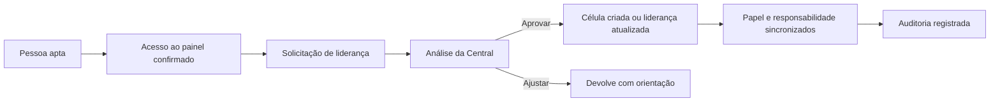

# Arquitetura de experiência e papéis

## 1. Princípio estrutural

O PastorAI não é um painel genérico. É um centro de operações pastorais que transforma conversas, pessoas, células, Agenda e Jornada G12 em ações claras para cada responsabilidade.

A experiência deve ser composta por quatro camadas:

1. **informação pública da igreja**, como agenda, avisos e conteúdos;
2. **contexto pessoal**, como meus dados, minha célula e minha caminhada;
3. **responsabilidades assumidas**, como liderar célula, ministério, consolidação ou atendimento;
4. **administração e governança**, restrita a quem realmente administra a igreja ou a plataforma.

Um usuário pode acumular responsabilidades. O sistema não deve escolher um único papel principal e descartar os demais.

## 2. Três superfícies

| Superfície | Público | Função |
|---|---|---|
| `app.igreja12.com.br` | membro, líder, pastor e admin | operação pastoral diária |
| `admin.igreja12.com.br` | admin da igreja | configuração, acessos, integrações e governança do tenant |
| `painel.igreja12.com.br` | master da plataforma | igrejas, planos, templates e governança global |

O SHA atual já separa app e admin. Essa evolução deve ser preservada.

## 3. Mapa de informação recomendado

```mermaid
flowchart TD
    A["App Igreja 12"] --> B["Hoje"]
    A --> C["Minha Igreja"]
    A --> D["Jornada G12"]
    A --> E["Minhas responsabilidades"]

    B --> B1["Ações que exigem atenção"]
    B --> B2["Agenda próxima"]
    B --> B3["Avisos e contexto"]

    C --> C1["Minha Célula"]
    C --> C2["Agenda"]
    C --> C3["Conteúdos e avisos"]
    C --> C4["Meus dados"]

    D --> D1["Ganhar"]
    D --> D2["Consolidar"]
    D --> D3["Discipular"]
    D --> D4["Enviar"]

    E --> E1["Conversas atribuídas"]
    E --> E2["Pessoas sob cuidado"]
    E --> E3["Células supervisionadas"]
    E --> E4["Ministérios e tarefas"]

    F["Admin da igreja"] --> F1["Configuração inicial"]
    F --> F2["Pessoas e acessos"]
    F --> F3["Permissões"]
    F --> F4["WhatsApp"]
    F --> F5["Agente IA"]
    F --> F6["Calendário"]
    F --> F7["Assinatura, somente dono"]
```



## 4. Navegação por dispositivo

### Desktop, 1024 pixels ou mais

- Sidebar persistente com grupos curtos.
- Topbar contextual com igreja, papel ou responsabilidade ativa, busca futura e ações locais.
- Conteúdo central com largura controlada, não uma grade de cards por padrão.
- Jornada G12 como caminho vivo, sutil e funcional, sem dominar toda tela.

### Tablet, 768 a 1023 pixels

- Sidebar recolhível.
- Cabeçalhos e filtros em duas linhas quando necessário.
- Tabelas complexas viram listas estruturadas ou master-detail.
- Ações destrutivas e formulários longos migram para drawer ou tela dedicada.

### Mobile, 360 a 767 pixels

- Bottom navigation com até cinco destinos de alta frequência.
- Demais áreas em menu Mais, filtradas por responsabilidade.
- Uma tarefa principal por tela.
- Botões com texto em uma linha. Quando o texto não cabe, usar rótulo mais curto, largura total ou ação secundária, nunca quebra interna arbitrária.
- Touch targets com pelo menos 44 por 44 CSS pixels.

## 5. Dashboard composto por responsabilidade

O Painel de Hoje não deve ser igual para todos e também não deve existir como uma sequência fixa de templates isolados. Ele deve combinar blocos autorizados.

### Ordem universal

1. pendência pessoal urgente;
2. tarefa atribuída;
3. responsabilidade liderada;
4. agenda e avisos da igreja;
5. contexto e progresso, sem ação quando o usuário só pode visualizar.

### Pastor ou admin operacional

- fila pastoral priorizada;
- conversas aguardando humano;
- pessoas sem acompanhamento ou em risco;
- próximos eventos e confirmações;
- saúde agregada de células e Jornada G12;
- atalhos para ações autorizadas.

### Líder de célula

- ações da própria célula;
- próxima reunião, planejamento e relatório;
- visitantes e pessoas vinculadas à célula;
- avisos da igreja e da Central;
- agenda da semana;
- discípulos sob responsabilidade explícita;
- nenhuma fila pastoral global.

### Líder de ministério ou outra responsabilidade

- tarefas e agenda daquele ministério;
- pessoas atribuídas à responsabilidade;
- avisos específicos;
- visão pública da igreja;
- nenhum dado global apenas por possuir um título de liderança.

### Membro

- próximos eventos;
- avisos da igreja e da própria célula;
- minha célula;
- minha caminhada e cursos quando disponíveis;
- estatísticas públicas sem ação administrativa.

### Pessoa com múltiplas responsabilidades

O dashboard agrega os blocos autorizados e permite alternar contexto, por exemplo, `Minha célula`, `Ministério de Mídia` e `Consolidação`. O sistema não duplica a mesma pendência em vários blocos.

## 6. Modelo de autorização alvo

### 6.1 Quatro objetos diferentes

| Objeto | O que representa | Exemplo |
|---|---|---|
| Pessoa | cadastro pastoral | membro, visitante, contato |
| Usuário do painel | identidade de login | acesso ativo, convidado, revogado |
| Responsabilidade | cargo ou função | líder de célula, pastor principal, coordenador de mídia |
| Vínculo ministerial | alcance relacional | célula, cobertura, discípulos, equipe |

Misturar esses objetos gera os conflitos atuais de convite, célula e liderança.

### 6.2 Papel base, capacidade e escopo

Papéis base continuam pequenos e estáveis. Responsabilidades customizadas não devem virar novos valores do enum de segurança.

```text
people.read          escopo: igreja | descendência | célula | atribuído | self
people.edit          escopo: igreja | célula | self
people.link_cell     escopo: igreja | equipe_ganhar
pipeline.advance     escopo: igreja | descendência | atribuído
chat.read            escopo: all | assigned
chat.transfer        escopo: all | own_team
cell.manage          escopo: all | supervised | own
dashboard.overview   escopo: church | public | own
event.manage         escopo: igreja | responsabilidade
```

A sidebar deriva das capacidades efetivas. O backend valida capacidade e escopo em cada consulta e ação.

### 6.3 Invariante de liderança de célula



Não deve ser possível:

- criar ou aprovar uma liderança sem acesso válido;
- conceder `lider_celula` sem liderança efetiva;
- alterar a célula de uma pessoa apenas para dar acesso ao painel;
- usar `tipo="lider"` como atalho manual.

## 7. Matriz de experiência resumida

| Área | Membro | Líder de célula | Líder especializado | Pastor | Admin da igreja | Master |
|---|---|---|---|---|---|---|
| Hoje | pessoal e público | própria célula | responsabilidade própria | igreja e pastoral | igreja e configuração | não operacional |
| Agenda | ver e responder | ver e responder | gerir se autorizado | gerir | gerir | não operacional |
| Minha Célula | membro | gerir própria | conforme vínculo | acompanhar | acompanhar | não |
| Central | não | solicitações próprias | supervisionadas | total | total | não |
| Ganhar | self ou conteúdo | escopo atribuído, sem vínculo | escopo atribuído | total | total | não |
| Consolidar | self ou discípulos | discípulos explícitos | escopo atribuído | total | total | não |
| Discipular | própria jornada | árvore autorizada | árvore autorizada | total | total | não |
| Enviar | conteúdo público | conteúdo e escopo autorizado | conforme função | total | total | não |
| Conversas | não por padrão | atribuídas | atribuídas | todas | todas | não |
| Pessoas administrativas | não | não | não | decisão de produto | total | não |
| Acessos e permissões | não | não | não | não por padrão | total | não |
| Configuração do agente | não | não | não | não | credencial e pedidos, conforme decisão | template e governança |

## 8. Conteúdo educativo em áreas restritas

Quando uma etapa possui ensinamento útil e público, mostrar uma página de compreensão sem expor dados nem ações. Exemplo para Enviar:

- o que significa Enviar;
- como a etapa se relaciona à visão G12;
- materiais aprovados pela igreja;
- minha posição e próximos passos, se autorizados.

Quando não houver conteúdo seguro ou útil, esconder a área. Uma página educativa nunca deve revelar que existem pessoas, quantidades ou registros restritos.

## 9. Correções prioritárias comprovadas

1. O backend de Ganhar, Pessoas e células precisa respeitar escopo de responsabilidade, não apenas o menu.
2. `Vincular célula` não pode ficar disponível a qualquer papel com acesso a Ganhar.
3. A fila do dashboard precisa filtrar por pessoa, célula ou atribuição.
4. Dar acesso ao painel precisa ser separado de mover alguém para uma célula.
5. Liderança efetiva, papel do sistema e acesso precisam ser sincronizados por uma transação auditável.
6. A transferência de conversa deve validar a matriz efetiva do destinatário.

## 10. Nomenclatura recomendada

- `Equipe e acessos`: usuários do painel, convites, papéis base e revogação.
- `Discípulos`: relação ministerial e acompanhamento, nunca gestão de login.
- `Pessoas`: cadastro pastoral completo, em superfície administrativa.
- `Minha rede`: visão relacional autorizada da árvore ministerial.
- `Configuração do agente`: credencial, modelo, estado e pedidos de mudança, conforme governança aprovada.

Não renomear Equipe para Discípulos, pois isso mistura segurança de acesso com relação pastoral.
