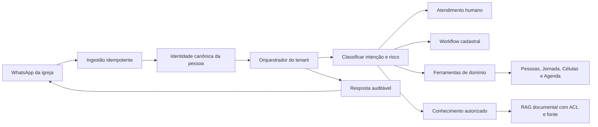

# Agente de IA no WhatsApp

## 1. Propósito

O agente não existe para imitar uma secretaria automática. Seu papel é receber, compreender, organizar e encaminhar o cuidado pastoral com segurança.

Ele deve:

- acolher quem fala com a igreja;
- reconhecer uma pessoa já cadastrada sem criar duplicatas;
- registrar um primeiro contato novo com o mínimo de dados;
- entender intenção e urgência;
- pedir consentimento antes de dados adicionais;
- atualizar o cadastro de forma progressiva e retomável;
- encaminhar para humano quando necessário;
- apoiar Ganhar, Consolidar, Células e Agenda por ferramentas autorizadas;
- respeitar opt-out, privacidade, escopo da igreja e limites do papel.

Ele não deve:

- inventar fatos sobre a pessoa ou a igreja;
- prometer atendimento humano imediato sem SLA;
- alterar dados sensíveis por interpretação livre;
- tratar uma conversa iniciada como consentimento universal para comunicação ativa;
- conhecer toda a base de membros por cópia diária em prompt;
- criar agentes pessoais independentes antes de existir governança de memória e autorização.

## 2. Estado atual no SHA auditado

| Capacidade | Estado | Observação |
|---|---|---|
| Primeiro contato cria Pessoa e conversa | `IMPLEMENTADO` | cria `contato`, `ganhar/novo_contato`, origem WhatsApp |
| Deduplicação por telefone | `PARCIAL` | worker resolve somente Pessoa ativa pelo telefone canônico e falha fechado em duplicidade; índice físico ainda usa telefone bruto |
| Idempotência de mensagem | `IMPLEMENTADO` | barreiras por `provider_message_id` |
| Saudação e consentimento | `PARCIAL` | existe base acolhedora e consentimento versionado, não o fluxo completo |
| Atualização cadastral em 12 passos | `AUSENTE` | não existe máquina de estados retomável |
| Revisão semestral | `AUSENTE` | não existem campos ou handler dedicado |
| CSIM / Fora da igreja | `PARCIAL` | pausa do agente funciona, classificação é heurística e pode gerar falso positivo |
| Orquestrador por igreja | `IMPLEMENTADO` | configuração ausente ou inativa impede resposta automática |
| LangGraph | `IMPLEMENTADO` | supervisor e subagentes, sem checkpoint durável |
| Memória conversacional | `AUSENTE` | não há checkpoint persistente |
| RAG documental | `AUSENTE` | sem embeddings ou recuperação de conhecimento |
| Ferramentas de domínio | `PARCIAL` | capacidades alinhadas aos papéis dos endpoints, alvo restrito à própria Pessoa e presença desabilitada até equivalência com reuniões |
| Criar célula por WhatsApp | `AUSENTE` | não há ferramenta correspondente |
| Evolution | `IMPLEMENTADO no código` | conexão, webhook, envio e status |
| Meta Cloud API direta | `AUSENTE` | não prometer integração oficial Meta |
| Broadcast e agendamento | `PARCIAL` | há ledger, worker e gates, mas produção e entrega final não foram comprovadas |
| Opt-out | `IMPLEMENTADO` | pedido contextual é persistido antes dos gates do agente, sem confundir remoção de membro ou cancelamento de reunião |
| Comunicação editorial automática | `AUSENTE` | não há coletores específicos para culto, blog, YouTube ou redes sociais |

## 3. Arquitetura alvo



Separar três mecanismos:

1. **workflow determinístico:** consentimento, atualização cadastral, confirmação, lembrete e revisão;
2. **agente conversacional:** linguagem natural, intenção, acolhimento e escolha do próximo passo;
3. **ferramentas autorizadas:** leitura e escrita de domínio com validações independentes do modelo.

O prompt não deve ser a única proteção.

## 4. Fluxo de boas-vindas

### 4.1 Entrada

1. validar instância e tenant;
2. rejeitar eco, duplicata e origem inválida;
3. normalizar telefone;
4. procurar Pessoa por identidade canônica;
5. criar `contato` somente se não existir;
6. abrir ou reutilizar conversa;
7. verificar opt-out, CSIM, consentimentos e atendimento humano em andamento;
8. escolher o próximo fluxo.

### 4.2 Mensagem inicial recomendada

Para pessoa desconhecida:

> Olá! Paz do Senhor. Sou o assistente da Igreja Filadélfia. Posso ajudar você e, se precisar, encaminhar sua conversa para nossa equipe. Como você gostaria de ser chamado?

Para pessoa reconhecida:

> Olá, {primeiro nome}! Paz do Senhor. Como posso ajudar você hoje?

Não revelar dados usados no reconhecimento. Em caso de identidade ambígua, pedir confirmação mínima e encaminhar para revisão.

## 5. Atualização cadastral progressiva

O conteúdo enviado pelo usuário é válido como intenção, mas não deve virar um questionário rígido e inseparável. A experiência alvo é curta por sessão, retomável e transparente.

### 5.1 Estados do workflow

```text
não_iniciado
consentimento_pendente
em_andamento
aguardando_resposta
pausado_pela_pessoa
aguardando_revisao_humana
concluido
cancelado
revisao_vencida
```

Campos de controle sugeridos:

```text
workflow_id
pessoa_id
igreja_id
versao_termo
etapa_atual
respostas_parciais
iniciado_em
ultima_interacao_em
concluido_em
cadastro_revisado_em
proxima_revisao_em
lembrete_em
origem
responsavel_revisao_id
```

### 5.2 Abertura e consentimento

> Estamos atualizando os dados de quem participa da igreja para melhorar nossa comunicação e cuidado. Posso fazer algumas perguntas? Você pode pausar quando quiser.

Ações:

- `Sim, vamos lá`
- `Agora não`
- `Quero falar com alguém`

Se a pessoa escolher Agora não, registrar a escolha. Um lembrete em dois dias só pode ocorrer se a finalidade e a política de comunicação permitirem.

### 5.3 Blocos de dados

#### Identidade e localização

- nome completo;
- telefone confirmado, sem pedir novamente quando já verificado;
- data de nascimento;
- bairro;
- cidade.

#### Vínculo com a igreja

- tempo de igreja;
- participa de célula;
- célula identificada por seleção segura ou revisão, não por texto livre definitivo;
- líder informado, tratado como sugestão até correspondência confiável;
- data de conversão, quando conhecida.

#### Jornada G12

- Encontro com Deus;
- Universidade da Vida;
- Capacitação Destino;
- etapa e subetapa atuais.

Respostas de trilha não devem promover estágio automaticamente quando a regra pastoral exigir comprovação.

#### Serviço e ministérios

- desejo de servir;
- áreas de interesse;
- ministérios atuais;
- disponibilidade, se a igreja decidir coletar.

#### Escuta

- o que a igreja pode melhorar;
- o que a pessoa sente falta;
- pedido de contato humano, se desejar.

Texto livre deve ser tratado como conteúdo pastoral potencialmente sensível, com acesso restrito, retenção e revisão.

### 5.4 Confirmação

Antes de concluir, resumir apenas os campos adequados e permitir:

- `Confirmar`;
- `Corrigir`;
- `Falar com alguém`.

Mensagem final:

> Obrigado! Seus dados foram enviados para atualização. Se algum vínculo precisar de confirmação da equipe, avisaremos por aqui. Deus abençoe sua vida.

Evitar afirmar “atualizado com sucesso” quando ainda existe revisão humana.

### 5.5 Revisão semestral

Regra alvo:

- a cada seis meses, verificar campos vencidos;
- perguntar primeiro se os dados continuam corretos;
- destacar célula, líder, ministério e contato;
- não repetir todo o questionário se nada mudou;
- respeitar opt-out e finalidade de comunicação;
- gerar pendência humana quando a resposta conflitar com vínculos oficiais.

## 6. Identidade e deduplicação

Telefone é um identificador operacional, não a identidade completa da pessoa.

Requisitos:

- armazenar telefone canônico separado da apresentação;
- índice único por `igreja_id + telefone_canonico` para pessoa ativa;
- preservar aliases e histórico de correção;
- detectar possível duplicata por nome, telefone anterior e vínculo;
- nunca fundir automaticamente dois cadastros com dados pastorais conflitantes;
- disponibilizar merge assistido, auditável e reversível em evolução própria.

## 7. CSIM / Fora da igreja

Exemplos: empresas, prestadores, pessoas sem vínculo ministerial ou contatos operacionais.

Regras:

- manter o rótulo visível `Fora da igreja`;
- manter a flag técnica separada do tipo ministerial;
- pausar autoengajamento pastoral;
- continuar registrando mensagens recebidas;
- permitir reversão por humano autorizado;
- não classificar permanentemente com uma única palavra-chave;
- usar confiança, contexto e, em casos ambíguos, confirmação humana.

## 8. Consentimentos por finalidade

O modelo alvo separa:

| Finalidade | Exemplo | Base de produto |
|---|---|---|
| Atendimento solicitado | responder uma pergunta recebida | necessário para o atendimento |
| Atualização cadastral | coletar data, célula e jornada | consentimento e transparência específicos |
| Cuidado pastoral | pedido de oração e acompanhamento | acesso restrito e minimização |
| Comunicação proativa | agenda, devocional, eventos | opt-in ou outra base validada com jurídico |
| Mídia e divulgação | depoimentos, imagem e voz | autorização própria quando aplicável |

Gate P0: a mensagem inbound atual não pode continuar sendo interpretada como permissão universal para broadcasts sem decisão jurídica e de produto.

## 9. Memória e conhecimento

### 9.1 Dados vivos

Pessoas, líderes, células, Agenda e responsabilidades devem ser consultados por ferramentas tenant-safe em tempo real. Não copiar toda a igreja diariamente para o prompt.

### 9.2 Memória conversacional

Persistir apenas o necessário para continuidade:

- resumo factual aprovado;
- tarefa pendente;
- etapa do workflow;
- responsável humano;
- consentimentos e preferências;
- referências às mensagens originais, conforme retenção.

Não guardar inferências espirituais ou psicológicas como fatos.

### 9.3 RAG documental

RAG é adequado para:

- visão e valores da igreja;
- perguntas frequentes;
- materiais aprovados;
- políticas de células;
- conteúdo de Enviar;
- orientações de eventos e cursos.

Cada resposta recuperada deve conhecer tenant, versão, audiência, validade e fonte. Banco em grafo não é requisito inicial. Começar com documentos versionados e busca com ACL; adicionar grafo somente se relações complexas comprovarem necessidade.

## 10. Governança do agente

### Estado atual

- master edita comportamento por igreja;
- admin da igreja solicita alteração;
- qualquer admin pode hoje configurar credencial, modelo, conexão e crons;
- somente OpenAI está implementada.

### Decisão recomendada

Criar a distinção `owner/admin principal` para ações de alto impacto:

- conectar ou trocar o WhatsApp;
- credencial e modelo de IA;
- permissões;
- assinatura;
- ativação de comunicação real.

O master mantém:

- template padrão;
- políticas e guardrails;
- versões do orquestrador;
- capacidade de suspender;
- auditoria global, sem acesso indiscriminado ao conteúdo pastoral.

Os admins locais podem solicitar ajustes de comportamento. A decisão sobre permitir instruções locais limitadas deve ser explícita.

## 11. Comunicação ativa

Fontes desejadas:

- agenda semanal;
- resumo do culto;
- resumo da reunião G12;
- post em rede social;
- post no blog;
- novo vídeo;
- devocional diário;
- eventos.

Arquitetura mínima por publicação:

```text
fonte aprovada
→ rascunho
→ revisão editorial
→ audiência e consentimento
→ prévia exata de payload, quantidade e destino
→ aprovação humana
→ outbox idempotente
→ entrega e falhas
→ relatório
```

Não tratar HTTP 2xx da Evolution como leitura ou entrega final. Exibir estados separados: preparado, aceito pelo provedor, entregue quando houver recibo, falhou, cancelado.

## 12. Ferramentas prioritárias do orquestrador

### Leitura

- localizar pessoa com escopo e minimização;
- consultar próximos eventos públicos;
- consultar célula e liderança da própria pessoa;
- consultar status de uma solicitação iniciada pela pessoa;
- localizar materiais aprovados.

### Escrita controlada

- registrar resposta de workflow cadastral;
- criar pedido de atendimento;
- registrar decisão por Cristo conforme regra atual;
- registrar visitante;
- solicitar vínculo ou correção de célula;
- confirmar presença ou interesse em evento;
- criar rascunho de tarefa para humano.

Criar célula, trocar liderança, alterar permissão, iniciar cobrança ou disparar massa continuam fora do agente autônomo.

## 13. Piloto recomendado para Filadélfia

Após smoke autenticado e operacional:

1. conexão Evolution comprovada;
2. primeiro contato e deduplicação;
3. caixa de conversas com transferência humana;
4. cadastro básico com consentimento;
5. revisão humana de CSIM;
6. ações já existentes de Ganhar e Consolidar;
7. Agenda apenas informativa até o envio real ser comprovado.

Não prometer no piloto:

- questionário semestral completo;
- memória ou RAG;
- criação de células pelo agente;
- assistentes pessoais separados de pastor e pastora;
- automação editorial completa;
- integração direta Meta Cloud API;
- suporte multiprovedor de IA.

## 14. Testes de aceite

- mensagem duplicada não cria Pessoa, conversa ou resposta duplicada;
- dois formatos do mesmo telefone não criam duas pessoas;
- pessoa conhecida é reconhecida sem expor dados;
- workflow pausa e retoma na etapa correta;
- opt-out impede novas comunicações proativas;
- cada finalidade de consentimento é registrada separadamente;
- CSIM ambíguo vai para revisão, não para bloqueio irreversível;
- ferramenta nunca atravessa tenant ou escopo;
- resposta com conteúdo recuperado inclui fonte e versão;
- falha do modelo não perde a mensagem recebida;
- envio real exige gate, prévia e outbox idempotente;
- segredo de webhook não aparece em log ou screenshot.

## 15. Evidências principais

- `backend/app/workers/queue_worker.py`
- `backend/app/agent/nodes.py`
- `backend/app/agent/runtime.py`
- `backend/app/agent/graph.py`
- `backend/app/agent/tools.py`
- `backend/app/domain/consent.py`
- `backend/app/domain/classification.py`
- `backend/app/domain/broadcast.py`
- `backend/app/routers/agent.py`
- `backend/app/routers/platform_admin.py`
- `backend/app/routers/whatsapp.py`
- `backend/app/routers/broadcasts.py`
- `backend/app/services/evolution.py`
- `backend/app/services/pessoa_dedup.py`
