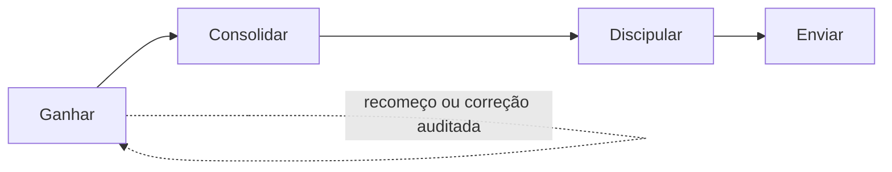

# Pessoas e Jornada G12

## 1. Objetivo

Construir uma única história da pessoa, desde o primeiro contato até sua caminhada, serviço e envio, sem misturar cadastro pastoral, acesso ao sistema, cargo e relacionamento ministerial.

## 2. Identidade da pessoa

### Classificações principais

| Classificação | Significado | Pode ficar sem célula ou líder? |
|---|---|---|
| Contato | iniciou relacionamento, identidade e intenção ainda em descoberta | sim |
| Visitante | participação real em culto, célula ou evento | sim, temporariamente |
| Membro | vínculo reconhecido com a igreja | apenas com regra de transição válida |
| Discípulo | acompanhamento ministerial explícito | não, precisa de liderança ou célula |
| Pastor | função pastoral reconhecida | exceções formais para pastor principal |
| Fora da igreja | contato sem interesse ministerial ou operacional | sim, fora do fluxo G12 |

`Fora da igreja` deve continuar como flag prioritária e reversível. Não deve ser um estágio da Jornada G12.

### Dados da Pessoa

#### Núcleo atual a preservar

- nome;
- telefone;
- origem;
- tipo;
- etapa e subetapa G12;
- célula;
- líder;
- aptidão para liderar;
- consentimentos;
- Fora da igreja;
- aceite de Jesus.

#### Extensões necessárias

- telefone canônico;
- data de nascimento;
- bairro e cidade estruturados;
- tempo de igreja;
- data de conversão;
- status de Encontro;
- status de Universidade da Vida;
- status de Capacitação Destino;
- ministérios atuais e interesses;
- cadastro revisado em;
- próxima revisão em;
- proveniência e confiança de cada campo;
- restrição de acesso para feedbacks e conteúdo pastoral sensível.

Campos declarados por WhatsApp não devem substituir vínculos oficiais sem validação.

## 3. Pessoa, acesso e liderança

Três perguntas diferentes:

1. Quem é essa pessoa para a igreja?
2. Ela pode entrar no painel?
3. O que ela pode ver e fazer?

O fluxo de acesso precisa ligar um `AppUser` a uma Pessoa existente sem alterar a célula. O SHA atual ainda exige célula no convite e bloqueia pessoas já vinculadas, criando uma contradição operacional.

### Fluxo alvo para dar acesso

```text
abrir Pessoa
→ Dar acesso ao painel
→ informar e-mail
→ escolher papel base inicial
→ enviar convite
→ aceitar convite
→ vincular AppUser à Pessoa existente
→ aplicar capacidades e escopos
```

Movimentação de célula ocorre em fluxo próprio.

## 4. Pessoas administrativas

O diretório completo de Pessoas deve ficar na superfície administrativa. Consultas operacionais devem ser menores e escopadas:

- `Minhas pessoas`, para atendimento atribuído;
- `Pessoas da minha célula`;
- `Meus discípulos`;
- `Pessoas em Ganhar sob minha responsabilidade`;
- busca mínima de destinatário quando uma ação exige seleção.

Esconder a tela não basta. Os endpoints precisam aplicar o mesmo escopo.

## 5. Jornada G12 como caminho vivo



O caminho deve comunicar:

- posição atual;
- próximo passo compreensível;
- responsável;
- pendência;
- última atualização;
- diferença entre autodeclaração, registro e confirmação pastoral.

O caminho é uma assinatura visual funcional, não decoração.

## 6. Ganhar

### Finalidade

Receber e compreender contatos e visitantes, registrar decisões e encaminhar o próximo cuidado.

### Capacidades desejadas

- novos contatos do WhatsApp;
- visitantes de culto, evento ou célula;
- intenção e origem;
- decisão por Cristo;
- pendências de identificação;
- atribuição a responsável;
- solicitação de vínculo com célula;
- histórico mínimo de contatos.

### Lacuna crítica atual

O backend lista o tenant inteiro e `Vincular célula` pode ser chamado por qualquer autenticado na primeira vinculação. Um líder de célula não pode receber poder global apenas porque enxerga Ganhar.

Escopos recomendados:

- pastor/admin: igreja;
- liderança de Ganhar: fila atribuída ou igreja, conforme decisão;
- líder de célula: pessoas explicitamente atribuídas ou ligadas à própria célula;
- membro: nenhuma ação, apenas conteúdo ou dados próprios quando houver.

## 7. Consolidar

### Finalidade

Garantir contato, cuidado inicial, integração e próximos passos após decisão ou visita.

### Experiência

- fila por prioridade e prazo;
- responsável visível;
- próxima ação clara;
- contato, resultado e observação;
- escalada para pastor quando necessário;
- conclusão com motivo;
- vínculo com célula sem permitir ações globais a quem só acompanha um discípulo.

### Escopos

- liderança de consolidação: fila autorizada;
- pastor/admin: visão total;
- líder de célula: apenas discípulos próprios quando explicitamente vinculados;
- pessoa consolidada: visão própria de próximos passos, sem registros internos.

## 8. Discipular

### Árvore ministerial

A pessoa pode ver:

- ascendência autorizada, com dados mínimos como nome e tempo de igreja;
- descendência direta e indireta sob sua responsabilidade, com dados compatíveis com o papel;
- posição própria na rede;
- cobertura e célula como relações diferentes.

### Privacidade

- ascendente não recebe dados completos por padrão;
- descendência só aparece quando o vínculo ministerial é confirmado;
- contagens públicas não revelam nomes;
- acesso direto por URL deve ser revalidado no backend;
- toda mudança de cobertura é auditada.

### Universidade da Vida e Capacitação Destino

Visões necessárias:

- aluno: sua matrícula, progresso, calendário e materiais;
- líder: apenas discípulos autorizados;
- liderança da formação e pastores: visão ampla;
- membro sem vínculo: conteúdo introdutório, quando aprovado, sem dados privados.

No SHA atual, UV e CD ainda aparecem como bloqueados ou em evolução. Não tratá-los como completos.

## 9. Enviar

Enviar deve combinar ensino e responsabilidade.

### Para quem ainda não tem acesso operacional

- o que é Enviar;
- por que a etapa existe;
- materiais aprovados;
- livros e artigos selecionados pela igreja;
- próximos passos pessoais quando disponíveis.

### Para quem possui responsabilidade

- pessoas e equipes enviadas;
- ministérios e campos de atuação;
- acompanhamento;
- metas, relatos e pendências;
- autorização e escopo definidos.

Não mostrar uma tela vazia com “acesso negado” quando conteúdo educativo seguro puder orientar. Também não expor dados restritos para preencher a página.

## 10. Papéis e responsabilidades customizadas

O pedido de CRUD de papéis revela duas necessidades:

1. papéis-base de segurança;
2. cargos e responsabilidades configuráveis da igreja.

Não ampliar indefinidamente o enum de papéis. Manter papéis-base estáveis e criar entidades configuráveis como:

- pastor principal;
- líder de Ganhar;
- líder de Consolidação;
- líder de ministério;
- coordenador da Central;
- professor de Universidade da Vida;
- responsável por evento.

Cada responsabilidade recebe capacidades, escopos, vigência, superior e substituto. A criação e alteração precisam de auditoria.

## 11. Pastor principal e organograma

Separar:

- proprietário da conta e assinatura;
- administrador técnico da igreja;
- pastor principal;
- liderança ministerial.

O organograma configurável precisa começar por um modelo simples:

```text
Pastor principal
├─ Pastores e líderes G12
├─ Central de Células
├─ Ministérios
└─ Lideranças de formação
```

Cada igreja pode ajustar cargos e relações sem quebrar as capacidades de segurança.

## 12. Estados e mensagens

### Pessoa sem célula

> Esta pessoa ainda não está vinculada a uma célula. Encaminhe a solicitação para a equipe responsável.

### Liderança em análise

> A Central está analisando esta nova liderança. Nenhuma permissão foi alterada ainda.

### Área educativa

> Esta etapa faz parte da Jornada G12. Você pode conhecer o propósito e acompanhar seus próprios próximos passos. Dados de outras pessoas ficam disponíveis apenas para responsáveis autorizados.

### Sem permissão

> Você não tem acesso a esta ação. Se isso não corresponde à sua responsabilidade atual, fale com um administrador da igreja.

## 13. Prioridades

### P0

- escopar Pessoas, Ganhar, células e fila por responsabilidade;
- bloquear vínculo de célula por API para papéis não autorizados;
- separar convite de acesso e movimentação de célula;
- sincronizar liderança, papel e acesso.

### P1

- campos pastorais e proveniência;
- responsabilidades configuráveis;
- pastor principal e organograma;
- fluxo de solicitação de nova liderança;
- dashboards por responsabilidade;
- árvore com privacidade.

### P2

- visão do aluno em UV e CD;
- conteúdo educativo de Enviar;
- merge assistido de duplicatas;
- histórico de atividade compreensível.

## 14. Testes de aceite

- Fora da igreja continua no fim e sem resposta automática;
- líder de célula não lista nem altera pessoas de outra célula;
- chamada direta à API não contorna o menu;
- membro não recebe ações da Jornada sobre terceiros;
- dar acesso não altera célula;
- liderança não existe sem acesso válido;
- papel `lider_celula` não existe sem liderança efetiva;
- árvore bloqueia pessoa fora do escopo;
- curso mostra visão correta para aluno, líder e direção;
- área educativa não vaza contagem ou identidade restrita.

## 15. Evidências principais

- `frontend/src/components/contacts/ContatosScreen.tsx`
- `frontend/src/components/contacts/EditContactModal.tsx`
- `frontend/src/components/pipeline/GanharScreen.tsx`
- `frontend/src/components/dashboard/DashboardScreen.tsx`
- `frontend/src/components/team/EquipeScreen.tsx`
- `frontend/src/lib/navigation.ts`
- `frontend/src/lib/permissions.ts`
- `backend/app/routers/contacts.py`
- `backend/app/routers/pipeline.py`
- `backend/app/routers/cells.py`
- `backend/app/routers/team.py`
- `backend/app/routers/conversations.py`
- `backend/app/routers/dashboard.py`
- `backend/app/routers/work_queue.py`
- `backend/app/domain/work_queue.py`
- `backend/app/domain/cell_requests.py`
