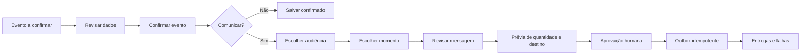

# Agenda e comunicação

## 1. Papel da Agenda

A Agenda é a fonte operacional de eventos da igreja. Ela alimenta o Painel de Hoje, a experiência de membros e líderes, as confirmações administrativas e, no futuro, comunicações aprovadas.

Não deve ser apenas uma cópia visual do Google Calendar nem um editor isolado.

## 2. Estado atual comprovado

| Capacidade | Estado | Observação |
|---|---|---|
| Semana, mês e ano | `IMPLEMENTADO`, com decisão de abertura | visões reais, navegação e tratamento mobile; hoje abre em Mês |
| A confirmar | `IMPLEMENTADO` | fila ordenada por data, restrita a pastor/admin |
| Criar, editar e excluir | `IMPLEMENTADO` | ações de gestão por papel |
| Evento recorrente | `PARCIAL` | recorrência aparece no contrato/apresentação, mas o formulário atual não oferece configuração completa |
| Detalhe de evento | `IMPLEMENTADO` | status, descrição, recorrência e origem |
| Importar do Google | `IMPLEMENTADO no código` | Google para PastorAI, com confirmação manual |
| Sincronizar alterações para Google | `AUSENTE` | criação, edição e exclusão locais não são push comprovado |
| Audiência por evento | `IMPLEMENTADO` | igreja, pastores, G12, líderes de célula e pessoas específicas |
| Momento e mensagem da notificação | `IMPLEMENTADO como intenção` | dados persistidos no modal, que informa honestamente que nada é enviado naquele momento |
| Disparo futuro da notificação | `AUSENTE` no recorte atual | confirmar não envia nem comprova que a mensagem será enviada no prazo escolhido |
| Aviso interno de confirmação | `PARCIAL` | mecanismo separado, depende de flag e destinatários administrativos |
| Aba Planejamento | `AUSENTE` | a tela atual possui quatro abas |
| Planejamento semanal assistido | `AUSENTE` | não há checklist editorial e operacional da semana |
| Produção, migrations e workers | `NÃO COMPROVADO` | auditoria estática, sem smoke autenticado |

## 3. Arquitetura da tela

Abas recomendadas:

1. `Semana`
2. `Mês`
3. `Ano`
4. `A confirmar`, somente quem pode confirmar
5. `Planejamento`, somente quem possui responsabilidade de planejamento

As quatro abas já existentes devem ser preservadas. Planejamento é uma extensão, não um redesenho completo.

### Semana

- visão principal para operação;
- próximos sete dias;
- agrupamento por dia;
- status e audiência visíveis sem poluição;
- ação primária `Novo evento` somente quando autorizada;
- acesso rápido ao detalhe.

Decisão pendente: manter Mês como abertura atual ou adotar Semana como abertura operacional. Validar com pastores e secretarias antes de alterar.

### Mês

- grade para orientação;
- dia selecionado abre lista legível abaixo ou em drawer;
- em mobile, não comprimir título completo em células minúsculas;
- pontos e contagens na grade, detalhes fora dela.

### Ano

- visão de densidade e sazonalidade;
- contagem por mês;
- navegação para o mês selecionado;
- sem tentativa de editar eventos diretamente.

### A confirmar

- importados do Google e rascunhos que exigem validação;
- ordenação por data do evento;
- origem, conflito e campos faltantes;
- confirmação com audiência, tempo e mensagem;
- opção de confirmar sem comunicar.

O estado pendente deve usar rótulo e ícone em todas as visões, não apenas vermelho.

### Planejamento

Objetivo: preparar a semana, não substituir o calendário.

Blocos possíveis no escopo V1:

- eventos sem responsável;
- eventos sem audiência definida;
- eventos importados aguardando confirmação;
- comunicações programadas e ainda não aprovadas;
- conflitos de horário ou local;
- resumo da semana pronto para revisão.

Geração automática de conteúdo editorial fica fora do wireframe principal até existir fluxo de revisão.

## 4. Modelo de evento

Campos mínimos:

```text
título
descrição
início e fim
fuso horário
local
responsável
origem: local | google
id externo e versão
status: rascunho | a_confirmar | confirmado | cancelado
recorrência
audiência
política de notificação
mensagem aprovada
última sincronização
conflito de sincronização
```

Responsável não é o mesmo que criador. Uma pessoa pode cadastrar e outra responder pelo evento.

## 5. Google Calendar

### Estado seguro atual

Tratar a integração como importação assistida até provar sincronização bidirecional.

O endpoint de importação aceita papel de Central/pastor enquanto a configuração do Google é apresentada como administrativa. A decisão sobre pastor versus owner/admin principal precisa ser fechada antes de ajustar qualquer gate.

### Evolução recomendada

1. exibir claramente a direção da sincronização;
2. armazenar versão e `etag` quando disponível;
3. detectar conflito antes de sobrescrever;
4. definir fonte de verdade por calendário;
5. registrar quem resolveu o conflito;
6. permitir desconectar sem apagar eventos locais;
7. nunca excluir no Google silenciosamente.

Estados de interface:

- conectado e atualizado;
- conexão expirada;
- importação em andamento;
- conflito encontrado;
- última sincronização incompleta;
- desconectado, eventos locais preservados.

## 6. Confirmação e comunicação por evento



Confirmar o evento e enviar comunicação são ações separadas. O usuário deve saber em qual delas está.

## 7. Audiências

Audiências atuais a preservar:

- toda a igreja;
- pastores;
- G12 pastoral;
- líderes de célula;
- pessoas específicas.

Extensões futuras, depois de autorização por escopo:

- uma ou mais células;
- ministério;
- etapa G12;
- participantes confirmados;
- responsáveis por uma tarefa.

Antes de qualquer envio, mostrar:

- quantidade estimada;
- quantidade excluída por opt-out ou falta de contato;
- canal;
- remetente;
- momento;
- texto exato;
- possibilidade de cancelar.

## 8. Dois tipos de aviso que não podem ser confundidos

### Comunicação do evento

Mensagem destinada à audiência pastoral ou operacional do próprio evento.

### Aviso interno de confirmação

Alerta administrativo de que um evento foi confirmado. O card atual de destinatários pertence a esse mecanismo.

Recomendação de nomenclatura:

- trocar `Destinatários de avisos` por `Quem recebe aviso interno de confirmação`;
- manter audiência e mensagem do evento dentro do fluxo de confirmar/editar evento;
- não fazer o admin configurar listas genéricas sem explicar a finalidade.

## 9. Planejamento de comunicação semanal

O módulo deve reunir, mas não gerar ou publicar sozinho:

| Origem | Conteúdo | Gate humano |
|---|---|---|
| Agenda | resumo da semana e eventos | revisar audiência e texto |
| Culto | resumo aprovado | revisar conteúdo pastoral |
| G12 | resumo da reunião | validar audiência restrita |
| Blog | novo post | revisar chamada e link |
| YouTube | novo vídeo | revisar título e destino |
| Redes sociais | post publicado | revisar reaproveitamento |
| Devocional | conteúdo do dia | aprovação editorial prévia |

Cada item vira um rascunho rastreável. Publicar ou enviar continua uma ação explícita.

## 10. Papéis e escopos

| Capacidade | Membro | Líder de célula | Responsável de evento | Pastor | Admin |
|---|---|---|---|---|---|
| Ver evento público | sim | sim | sim | sim | sim |
| Responder presença | quando habilitado | quando habilitado | sim | sim | sim |
| Criar evento | não | somente se concedido | escopo próprio | sim | sim |
| Editar evento | não | escopo próprio | escopo próprio | sim | sim |
| Confirmar importado | não | não | se concedido | sim | sim |
| Definir audiência | não | não | escopo próprio | sim | sim |
| Enviar comunicação | não | não por padrão | aprovação específica | sim | sim |
| Conectar Google | não | não | não | não por padrão | owner/admin principal |

## 11. Diretrizes visuais

- preservar a fundação atual;
- aumentar padding interno onde o texto encosta na margem;
- nenhum botão quebra texto em duas linhas;
- status usa cor mais rótulo, nunca apenas cor;
- vermelho fica reservado a conflito, cancelamento ou ação urgente;
- eventos locais e importados usam origem textual e ícone discreto;
- cabeçalho mantém ação primária em posição previsível;
- mobile usa lista e drawer, não calendário ilegível comprimido;
- foco de teclado percorre dia, evento e ação em ordem lógica.

## 12. Estados transversais

| Estado | Comportamento |
|---|---|
| vazio | explicar e oferecer ação autorizada |
| carregando | preservar layout e período selecionado |
| erro | manter dados anteriores e permitir tentar novamente |
| offline | leitura em cache quando segura, escrita desabilitada com explicação |
| sem permissão | retirar ação, manter conteúdo público quando aplicável |
| conexão expirada | mostrar reconectar sem perder agenda local |
| conflito | comparar versões e pedir decisão |
| envio agendado | mostrar momento, audiência e cancelar |
| envio parcial | separar aceitos, falhos e pendentes |

## 13. Prioridades

### P0

- comprovar se o dispatcher de notificação futura existe e está operacional;
- separar consentimento de atendimento e comunicação proativa;
- garantir outbox, idempotência, cancelamento e auditoria;
- smoke autenticado da Agenda e Google.

### P1

- aba Planejamento;
- nomenclatura do aviso interno;
- responsável do evento;
- estados de conflito e conexão;
- ajuste visual de paddings, botões e mobile.

### P2

- sincronização bidirecional com resolução de conflito;
- audiências por célula, ministério e etapa;
- resumo semanal assistido;
- telemetria de entrega.

## 14. Testes de aceite

- semana, mês, ano e A confirmar preservam estado ao navegar;
- evento importado nunca é tratado como confirmado sem ação;
- confirmar sem comunicação não cria entrega;
- confirmar com comunicação mostra quantidade e texto antes do envio;
- opt-out e CSIM são excluídos da audiência adequada;
- retry não duplica envio;
- desconectar Google não apaga evento local;
- conflito não sobrescreve nenhuma versão automaticamente;
- botão não quebra linha em 360, 390, 414, 768 e 1024 pixels;
- toda célula do calendário e todo evento são operáveis por teclado;
- zoom de 200 por cento mantém leitura e ações essenciais.

## 15. Evidências principais

- `frontend/src/components/calendario/CalendarioScreen.tsx`
- `frontend/src/components/calendario/EventFormModal.tsx`
- `frontend/src/components/calendario/EventDetailModal.tsx`
- `frontend/src/components/calendario/ConfirmEventModal.tsx`
- `frontend/src/components/calendario/CalendarConnectCard.tsx`
- `frontend/src/components/calendario/AlertRecipientsCard.tsx`
- `backend/app/routers/events.py`
- `backend/app/routers/calendar.py`
- `backend/app/services/event_recipients.py`
- `backend/app/services/event_notify.py`
