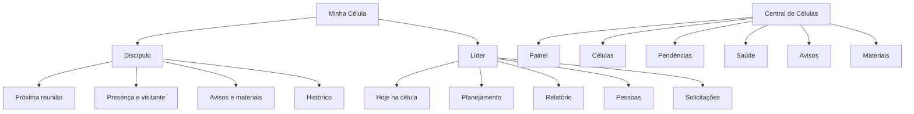
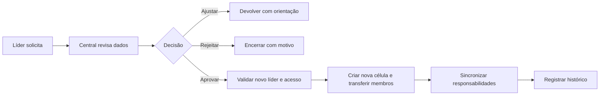

# Células e Central de Células

## 1. Princípios preservados

- `Minha Célula` é a superfície operacional do discípulo e do líder.
- `Central de Células` é a superfície de supervisão, cadastro, aprovação e saúde.
- Central nunca fica dentro de Minha Célula.
- Célula e árvore ministerial são relações diferentes.
- Campos sensíveis da célula passam por solicitação e aprovação.
- Saúde usa sinais compreensíveis das últimas reuniões, sem score opaco.

## 2. Estado atual no SHA auditado

### Minha Célula, discípulo

| Capacidade | Estado |
|---|---|
| próxima reunião | `IMPLEMENTADO` |
| confirmar presença | `IMPLEMENTADO` |
| indicar visitante | `IMPLEMENTADO` |
| avisos | `IMPLEMENTADO` |
| materiais | `IMPLEMENTADO` |
| histórico | `IMPLEMENTADO` |
| loading, vazio, erro e retry | `IMPLEMENTADO` |
| hero com participantes, convite, grupo e localização | `AUSENTE` nessa superfície |

### Minha Célula, líder

| Capacidade | Estado | Limite atual |
|---|---|---|
| identificar célula liderada | `IMPLEMENTADO` | resolução depende de várias chamadas e fallback no cliente |
| planejar reunião | `PARCIAL` | data, hora e tema, sem roteiro e responsáveis completos |
| presença | `IMPLEMENTADO` | dentro do relatório |
| visitantes | `IMPLEMENTADO` | expectativa e comparecimento |
| decisões, orações e observações | `IMPLEMENTADO` | registros tipados |
| oferta e observações | `IMPLEMENTADO` | rascunho antes de envio |
| enviar e bloquear relatório | `IMPLEMENTADO` | envio torna relatório não editável |
| discípulos | `IMPLEMENTADO` | escopo depende das APIs atuais |
| avisos da célula | `IMPLEMENTADO` | publicar e inativar, sem edição |
| materiais | `IMPLEMENTADO em leitura` | Central publica somente URL |
| alteração de campos sensíveis | `IMPLEMENTADO` | depende de flag de solicitações |
| solicitar multiplicação | `IMPLEMENTADO` | decisão pela Central |

### Central de Células

| Capacidade | Estado | Limite atual |
|---|---|---|
| dashboard | `IMPLEMENTADO` | operação em produção não comprovada |
| gerenciar células | `IMPLEMENTADO` | criar, editar, convidar e listar membros |
| saúde das células | `IMPLEMENTADO` | últimas reuniões e sinais visuais |
| relatórios pendentes | `IMPLEMENTADO` | fila da Central |
| solicitações | `IMPLEMENTADO` | aprovar, rejeitar e pedir ajuste |
| multiplicações | `IMPLEMENTADO` | pendentes e registradas |
| avisos | `IMPLEMENTADO` | publicar e inativar |
| materiais | `IMPLEMENTADO` | URL, título e descrição, sem upload |
| transferência e remoção de membro | `PARCIAL` | tipos existem, mas não foi comprovado um fluxo completo de abertura na UI atual |
| nova liderança por solicitação | `AUSENTE` | não há solicitação canônica que sincronize célula e acesso |
| campos ricos da célula | `PARCIAL` | backend aceita endereço, anfitrião, auxiliar, grupo, localização e convite, frontend envia apenas o conjunto básico |
| aviso real no WhatsApp | `AUSENTE` | o serviço atual grava intenção e não comprova entrega |

O produto atual está muito além dos documentos iniciais. Não redesenhar essas capacidades como se estivessem ausentes.

## 3. Arquitetura da experiência



## 4. Minha Célula, visão do discípulo

### Ordem da tela

1. próxima reunião;
2. ação de confirmar presença;
3. avisos importantes;
4. materiais da semana;
5. histórico recente.

### Estado sem célula

> Você ainda não está vinculado a uma célula. Se já participa de uma, avise sua liderança para corrigirmos seu cadastro.

Não oferecer `Criar célula` ou `Vincular agora` ao membro.

### Contexto ainda faltante

Completar a superfície do membro com dados leves já disponíveis ou previstos:

- nome e contexto da célula;
- líder;
- dia, horário e localização;
- participantes autorizados;
- acesso ao grupo ou convite, quando seguro;
- orientação para corrigir vínculo.

## 5. Minha Célula, visão do líder

### Cabeçalho compacto

- nome da célula;
- dia, horário e bairro;
- cobertura;
- próxima reunião;
- ações `Planejar reunião` e `Relatar reunião`.

O cabeçalho não deve virar um card gigante. A tarefa da semana precisa aparecer primeiro.

### Planejamento da reunião

O modal atual com data, hora e tema é uma base válida. Evolução recomendada, em seções curtas:

#### Encontro

- data e hora pontuais;
- tema;
- local quando excepcional;
- material da semana.

#### Participação

- responsáveis por boas-vindas;
- louvor ou dinâmica;
- palavra;
- crianças, quando aplicável;
- acompanhamento de visitantes.

#### Foco pastoral

- pessoas a contatar;
- aniversários e fatos públicos relevantes;
- pedidos que podem ser compartilhados com a equipe autorizada;
- objetivo da reunião.

O planejamento deve salvar rascunho e permitir retorno no mobile.

### Relatório da reunião

Preservar as seções atuais:

- presença;
- visitantes;
- decisões;
- orações;
- observações;
- oferta;
- envio final.

Melhorias:

- mostrar progresso de preenchimento sem transformar em wizard;
- permitir correção pela Central por fluxo auditado, sem editar silenciosamente o payload do líder;
- distinguir falta de dado de valor zero;
- evitar textarea encostado na borda;
- salvar rascunho automaticamente ou avisar antes de sair.

O modelo de visitante já possui telefone, mas a API e a UI atuais não concluem telefone e decisão por Cristo ponta a ponta. Esse fluxo precisa criar ou localizar Pessoa de forma idempotente e alimentar Ganhar sem duplicação.

O alerta de relatório após duas horas existe como regra de pendência para a Central, mas ainda precisa aparecer de forma clara na visão do líder e ter política de cobrança real separada de mera intenção.

## 6. Pessoas da célula

O líder pode:

- ver membros da própria célula;
- acompanhar presença e necessidades operacionais;
- indicar visitante;
- solicitar correção ou transferência;
- acompanhar discípulos explicitamente ligados a ele.

O líder não pode:

- listar todas as células ou pessoas da igreja;
- vincular qualquer pessoa diretamente;
- remover ou transferir sem fluxo da Central;
- conceder papel do sistema;
- ver dados pastorais fora de sua responsabilidade.

## 7. Central de Células

### Painel

Priorizar:

1. relatórios atrasados;
2. solicitações aguardando;
3. células sem reunião recente;
4. multiplicações em análise;
5. avisos e materiais recentes.

Contagens devem abrir a fila correspondente.

### Gerenciar células

Preservar o CTA de nova célula na Central. A tela legada não deve ser a única porta.

Campos:

- nome;
- líder;
- cobertura;
- anfitrião e auxiliar;
- endereço;
- dia e horário;
- status;
- data de início;
- histórico de liderança e multiplicação.

Prioridade de baixo risco: expor no frontend os campos ricos que o backend já aceita antes de criar novas migrations.

### Solicitações

Tipos atuais:

- alterar dia;
- alterar horário;
- alterar endereço;
- alterar anfitrião;
- alterar auxiliar;
- multiplicação;
- transferência e remoção, presentes no domínio.

Tipos necessários:

- nova liderança ou nova célula;
- encerramento de liderança;
- correção de vínculo de membro;
- mudança de cobertura.

Toda decisão registra solicitante, decisor, motivo, antes e depois.

Antes de aprovar multiplicação, transferência, remoção ou mudança sensível, mostrar um diálogo de confirmação com resumo do impacto. A UI atual pode chamar a aprovação diretamente.

### Saúde

Manter sinais simples das últimas dez reuniões:

- relatório entregue;
- frequência;
- visitantes;
- decisões e acompanhamentos;
- continuidade.

Não condensar tudo em uma nota misteriosa. Mostrar o motivo do alerta e a ação recomendada.

Indicadores complementares da Central, após validar fonte e utilidade:

- total de células ativas;
- percentual de relatórios recebidos no período;
- visitantes do mês;
- participantes ativos;
- percentual da igreja vinculado a células.

## 8. Materiais

### Estado atual

- Central publica título, URL e descrição;
- líder e discípulo leem;
- material pode ser inativado;
- upload não existe.

### Evolução

- rascunho e publicação;
- data de vigência;
- público, igreja, líderes ou células;
- tags simples;
- edição ou nova versão;
- prévia segura do link;
- histórico de quem publicou;
- arquivo somente após projeto específico de storage, permissão e antivírus.

YouTube, blog e outros links podem ganhar metadados, mas sempre com fallback e revisão.

## 9. Avisos

### Estado atual

- Central publica para igreja ou célula;
- líder publica para a própria célula;
- aviso pode ser inativado;
- edição não existe.

### Evolução

- início e expiração;
- prioridade;
- audiência clara;
- rascunho;
- correção por nova versão;
- confirmação de leitura apenas quando houver necessidade real;
- opção de transformar em comunicação, com consentimento e aprovação.

Não usar vermelho para todo aviso da Central. Vermelho deve indicar urgência ou risco.

O estado `notificado` não deve ser exibido como entregue enquanto o serviço continuar sendo no-op. Usar `comunicação não enviada` ou omitir o status até existir outbox real.

## 10. Multiplicação



Gate P0: novo líder precisa ter Pessoa apta, acesso ativo e papel sincronizado. O fluxo deve ser transacional.

## 11. Autorização

O backend precisa aplicar escopos:

```text
cell.read       own | supervised | all
cell.manage     own | supervised | all
cell.members    own | supervised | all
cell.report     own | supervised | all
cell.request    own | supervised | all
cell.material   public | leader | central
cell.notice     own | supervised | church
```

O endpoint geral `GET /cells` não deve entregar toda a igreja a um líder apenas porque a interface usa um seletor.

## 12. Direção visual

O usuário relatou que Minha Célula e Agenda ainda parecem desalinhadas em produção. A auditoria autenticada não ocorreu, então o problema visual fica `RELATADO, NÃO MEDIDO`.

Regras para a próxima validação:

- uma superfície principal, não uma pilha uniforme de cards;
- separar `esta semana`, `relatório` e `gestão`;
- padding interno consistente de 16 a 24 pixels;
- botões sem quebra de linha;
- campos longos com largura e altura confortáveis;
- abas roláveis acessíveis em mobile;
- feedback de rascunho e envio perto da ação;
- ações da Central não aparecem em Minha Célula;
- conteúdo que já existe deve ser reorganizado, não refeito do zero.

## 13. Prioridades

### P0

- escopar lista de células e membros no backend;
- corrigir invariante de acesso e liderança;
- verificar flags e migrations do fluxo de solicitações;
- completar visitante com telefone e decisão, integrado a Pessoas/Ganhar de forma idempotente;
- adicionar confirmação de impacto antes de aprovações sensíveis;
- smoke por membro, líder, pastor e admin.

### P1

- alinhamento visual autenticado de Minha Célula;
- contexto canônico do líder fornecido pelo backend;
- alinhar o formulário da Central aos campos ricos já aceitos pelo backend;
- planejamento de reunião enriquecido e retomável;
- abertura de transferência/remoção pela Central;
- solicitação de nova liderança;
- agendamento e versão de avisos e materiais.

### P2

- anexos seguros;
- metadados de links;
- histórico de atividade por célula;
- comunicação derivada de avisos com aprovação.

## 14. Testes de aceite

- membro vê somente sua célula;
- líder vê e altera somente a própria célula;
- pastor/admin vê Central conforme capacidade;
- campos sensíveis nunca mudam sem aprovação;
- flag desligada mostra módulo indisponível, não erro genérico;
- relatório preserva rascunho e bloqueia após envio;
- Central pede ajuste sem alterar o relato original;
- transferência não cria dupla membresia ativa;
- multiplicação sincroniza novo líder, papel e membros;
- telas funcionam em 360, 390, 414, 768, 1024 e 1440 pixels;
- teclado, zoom e leitor de tela alcançam abas, seções e dialogs.

## 15. Evidências principais

- `frontend/src/components/minha-celula/`
- `frontend/src/components/central-celula/`
- `frontend/src/components/cells/`
- `frontend/src/lib/cells-api.ts`
- `frontend/src/lib/cell-meetings-api.ts`
- `frontend/src/lib/cell-requests-api.ts`
- `frontend/src/lib/cell-notices-api.ts`
- `frontend/src/lib/cell-materials-api.ts`
- `backend/app/routers/cells.py`
- `backend/app/routers/cell_meetings.py`
- `backend/app/routers/cell_requests.py`
- `backend/app/routers/cell_notices.py`
- `backend/app/routers/cell_materials.py`
- `backend/app/services/cell_requests_service.py`
- `backend/app/domain/cell_requests.py`
