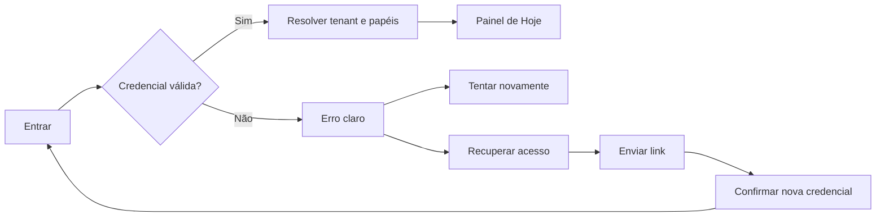
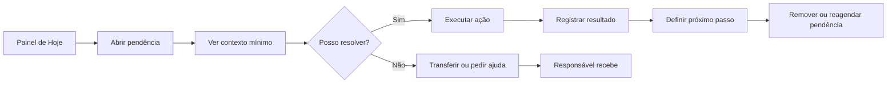
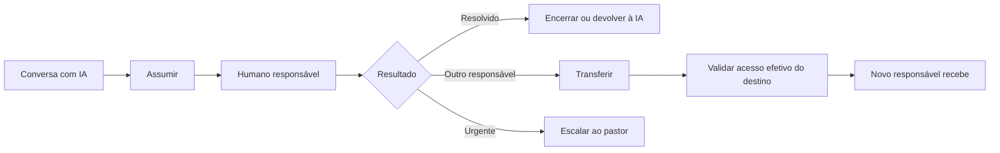
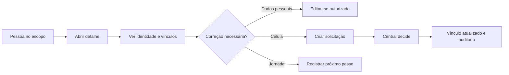
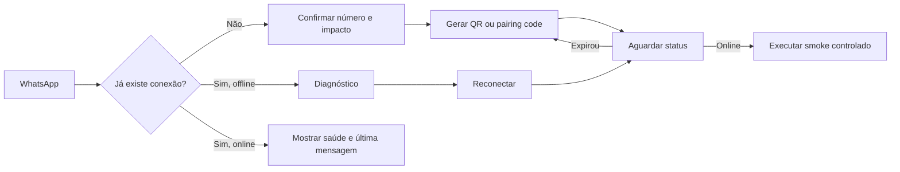

# Fluxos e wireframes essenciais

Estes wireframes são determinísticos. Eles organizam capacidades atuais e gaps aprováveis. Não representam código implementado.

## 1. Fluxo de acesso



Requisitos:

- não revelar se um e-mail pertence a uma igreja;
- autenticação acessível;
- retorno ao destino autorizado após login;
- sessão indisponível diferente de senha incorreta;
- recuperação sem depender de memória ou desafio cognitivo.

## 2. Dashboard desktop

```text
+----------------------+-------------------------------------------------------------+
| IGREJA 12            | Hoje, segunda-feira                         [Ajuda] [Perfil] |
| Painel de Hoje       +-------------------------------------------------------------+
| Minha Célula         | Bom dia, Ana. Há 3 ações sob sua responsabilidade.          |
| Agenda               | [ Ver minha célula ] [ Abrir Agenda ]                       |
| Conversas            +--------------------------------------+----------------------+
|                      | PRECISA DE ATENÇÃO                   | PRÓXIMOS EVENTOS     |
| JORNADA G12          |                                      |                      |
| Ganhar               | 1  Relatório da célula atrasado      | Hoje 19:30           |
| Consolidar           |    Célula Esperança                  | Reunião da célula    |
| Discipular           |    [Relatar reunião]                 |                      |
| Enviar               |                                      | Qua 20:00            |
|                      | 2  2 visitantes sem próximo passo    | Culto de celebração  |
| MINHAS RESP.         |    [Ver visitantes]                  |                      |
| Mídia                |                                      | [Ver Agenda]         |
|                      | 3  Conversa atribuída há 18 min      |                      |
| [Admin, se permitido]|    [Continuar atendimento]           | AVISOS               |
|                      +--------------------------------------+----------------------+
|                      | CAMINHO G12                                                 |
|                      | Ganhar -> Consolidar -> Discipular -> Enviar                |
|                      | 4 pessoas precisam de próximo passo      [Abrir Jornada]    |
+----------------------+-------------------------------------------------------------+
```

Regras:

- fila primeiro;
- no máximo três itens no primeiro viewport;
- bloco varia por responsabilidade;
- membro recebe agenda, avisos, própria célula e próprios dados, sem fila global;
- nenhum contador abre dados fora do escopo.

## 3. Dashboard mobile

```text
+----------------------------------+
| Igreja 12                 [Perfil]|
| Hoje                             |
|                                  |
| Bom dia, Ana                     |
| 3 ações para você                |
|                                  |
| [!] Relatório atrasado           |
|     Célula Esperança             |
|     [Relatar reunião]            |
|                                  |
| [ ] 2 visitantes sem próximo     |
|     passo                        |
|     [Ver visitantes]             |
|                                  |
| Próximos eventos                 |
| Hoje, 19:30                      |
| Reunião da célula                |
|                                  |
| Sua caminhada                    |
| Ganhar > Consolidar > Discipular |
|                                  |
| [Hoje] [Célula] [Agenda] [Mais]  |
+----------------------------------+
```

## 4. Resolver pendência pastoral



Toda pendência mostra motivo, prazo, pessoa ou objeto, responsável, última ação e próximo passo.

## 5. Conversas desktop

```text
+----------------------+------------------------------+--------------------------+
| CONVERSAS            | Maria Souza                  | CONTEXTO                 |
| [Buscar] [Filtros]   | WhatsApp, aguardando você    | Maria Souza              |
|                      | [Devolver à IA] [Transferir] | Visitante                |
| > Maria Souza   18m  +------------------------------+ Célula: não vinculada    |
|   Preciso conversar  |                              | Jornada: Ganhar          |
|                      | Maria: Paz. Preciso de ajuda.|                          |
|   João Lima     32m  |                              | Próximo passo            |
|   IA respondendo     | IA: Posso encaminhar você... | [Abrir no Ganhar]        |
|                      |                              |                          |
|   Empresa X      2h  | Sistema: Ana assumiu.        | Atendimento              |
|   Fora da igreja    |                              | Ana, há 18 min           |
|                      | Ana: Olá, Maria...            | [Transferir]             |
| [Atribuídas a mim]   |                              |                          |
| [Aguardando humano]  +------------------------------+ Consentimentos           |
| [Com IA]             | [Escreva uma mensagem...]   | Atendimento: ativo       |
| [Fora da igreja]     | [Anexar]             [Enviar]| Comunicação: não definido|
+----------------------+------------------------------+--------------------------+
```

Estados:

- `Com IA`;
- `Aguardando humano`;
- `Em atendimento por {nome}`;
- `Resolvida`;
- `Fora da igreja, IA pausada`;
- `Falha de conexão`.

## 6. Conversas mobile

Lista e thread nunca aparecem comprimidas lado a lado.

```text
LISTA                              THREAD
+----------------------------+    +----------------------------+
| Conversas           [Filtro]|    | [Voltar] Maria Souza       |
| [Buscar]                    |    | Aguardando você            |
|                            |    | [Ações]                    |
| Maria Souza           18m  |    |                            |
| Preciso conversar          | -> | Maria: Preciso de ajuda.   |
|                            |    | IA: Posso encaminhar...    |
| João Lima             32m  |    |                            |
| IA respondendo             |    | [Mensagem...]      [Enviar]|
+----------------------------+    +----------------------------+
```

## 7. Assumir, devolver e transferir conversa



Devolver à IA exige resumo factual e confirma que não há tarefa humana pendente.

## 8. Agenda desktop

```text
+--------------------------------------------------------------------------+
| Agenda                                      [Hoje]       [+ Novo evento] |
| [Semana] [Mês] [Ano] [A confirmar 3] [Planejamento]                     |
|--------------------------------------------------------------------------|
| <  10 a 16 de agosto de 2026  >                                          |
|                                                                          |
| SEG 10                                                                   |
| 19:30  Reunião G12 Pastoral                         [Ver detalhes]        |
|                                                                          |
| TER 11                                                                   |
| 20:00  Culto de ensino                              [Ver detalhes]        |
|                                                                          |
| QUA 12                                                                   |
| [!] 18:00  Encontro de líderes, importado do Google [Confirmar]          |
|                                                                          |
| QUI 13                                                                   |
| 19:30  Células locais, 14 encontros                 [Ver células]        |
+--------------------------------------------------------------------------+
```

Detalhe:

```text
+--------------------------------------------------+
| Encontro de líderes                      [Fechar] |
| Quarta, 12 ago, 18:00                            |
| Local ainda não informado                        |
| Origem: Google Calendar                          |
| Status: A confirmar                              |
|                                                  |
| [Editar dados] [Confirmar evento]                |
+--------------------------------------------------+
```

## 9. Agenda mobile

```text
+----------------------------------+
| Agenda                [+ Evento] |
| [Semana][Mês][Ano][Confirmar 3]  |
|                                  |
| 10 a 16 de agosto        [Hoje]  |
|                                  |
| HOJE                             |
| 19:30                            |
| Reunião G12 Pastoral             |
|                                  |
| AMANHÃ                           |
| 20:00                            |
| Culto de ensino                  |
|                                  |
| [!] QUA, 18:00                   |
| Encontro de líderes              |
| A confirmar           [Confirmar]|
|                                  |
| [Hoje] [Célula] [Agenda] [Mais]  |
+----------------------------------+
```

## 10. Confirmar evento

```text
+--------------------------------------------------+
| Confirmar evento                         [Fechar] |
|                                                  |
| Encontro de líderes                              |
| Quarta, 12 de agosto, 18:00                      |
|                                                  |
| Comunicar este evento?          [Sim / Não]      |
| Público                          [Líderes v]      |
| Quando                           [1 dia antes v]  |
| Mensagem                                         |
| [Encontro de líderes amanhã às 18h...]           |
|                                                  |
| Atenção: nada será enviado agora.                |
|                                                  |
| [Cancelar]                    [Confirmar evento]  |
+--------------------------------------------------+
```

Quando o dispatcher existir, inserir uma etapa posterior de prévia de audiência e aprovação.

## 11. Minha Célula, membro

```text
+--------------------------------------------------------------------------+
| Minha Célula, Esperança                                                   |
| Líder: Carlos Lima | Quinta, 19:30 | Bairro Centro                        |
|--------------------------------------------------------------------------|
| PRÓXIMA REUNIÃO             | AVISOS                                      |
| Qui, 13 ago, 19:30          | Mutirão solidário no sábado                 |
| Tema: Uma vida com propósito| Reunião desta semana confirmada             |
| [Confirmar presença]        |                                             |
| [Indicar visitante]         | MATERIAIS                                   |
|                             | Estudo 04, O chamado                        |
| PARTICIPANTES               | [Abrir material]                            |
| 12 pessoas                  |                                             |
| [Ver participantes]         | HISTÓRICO                                   |
|                             | 3 confirmações, 1 ausência                  |
+--------------------------------------------------------------------------+
```

## 12. Minha Célula, líder

```text
+--------------------------------------------------------------------------+
| Célula Esperança                              [Planejar reunião]          |
| Quinta, 19:30 | 12 pessoas | Próxima reunião em 3 dias                   |
|--------------------------------------------------------------------------|
| PRECISA DE ATENÇÃO                                                        |
| [!] Relatório da última reunião ainda não enviado  [Continuar relatório] |
| [ ] 2 visitantes aguardam próximo passo            [Ver visitantes]      |
|--------------------------------------------------------------------------|
| [Reuniões] [Pessoas] [Avisos] [Materiais] [Solicitações]                 |
|                                                                          |
| Reunião de 13 de agosto                                                   |
| Tema: Uma vida com propósito                                              |
| Responsáveis: Boas-vindas, Ana | Palavra, Carlos                          |
| [Editar planejamento] [Abrir relatório]                                   |
+--------------------------------------------------------------------------+
```

## 13. Central de Células

```text
+--------------------------------------------------------------------------+
| Central de Células                                      [+ Nova célula]  |
| [Painel] [Células] [Solicitações 4] [Avisos] [Materiais]                 |
|--------------------------------------------------------------------------|
| PRECISA DE ATENÇÃO                | REDE                                  |
| 3 relatórios pendentes            | 24 células ativas                     |
| 4 solicitações aguardando         | 81% relatórios no período             |
| 1 multiplicação em análise        | 18 visitantes no mês                  |
| [Abrir pendências]                |                                       |
|--------------------------------------------------------------------------|
| SAÚDE DAS CÉLULAS                                                         |
| Célula Esperança  ● ● ● ● ○ ○ ● ● ● ○  [Ver]                            |
| Célula Vida       ● ● ○ ○ ○ ○ ● ○ ○ ○  [Acompanhar]                      |
+--------------------------------------------------------------------------+
```

## 14. Jornada G12

```text
+--------------------------------------------------------------------------+
| Jornada G12                                                               |
| [1 Ganhar]---[2 Consolidar]---[3 Discipular]---[4 Enviar]                 |
|--------------------------------------------------------------------------|
| CONSOLIDAR                                                                |
| 8 pessoas sob sua responsabilidade                                        |
|                                                                          |
| Precisa de atenção                                                        |
| Maria Souza    contato inicial há 2 dias       [Registrar contato]        |
| João Lima      sem célula                      [Solicitar vínculo]        |
|                                                                          |
| Minha caminhada                                                           |
| Etapa atual: Discipular                                                   |
| Universidade da Vida: concluída                                           |
| Capacitação Destino: em andamento                                         |
+--------------------------------------------------------------------------+
```

Uma pessoa sem acesso operacional recebe conteúdo próprio e educativo, nunca a fila de terceiros.

## 15. Acompanhar Pessoa e célula



## 16. Administração

```text
+------------------------+-------------------------------------------------+
| ADMIN IGREJA 12        | Configuração Inicial                           |
| Configuração Inicial   | 4 de 6 itens concluídos                        |
| Identidade             |                                                 |
| Pessoas                | [ok] Identidade visual          [Ver]          |
| Equipe e acessos       | [ok] Pessoas e equipe           [Ver]          |
| Permissões             | [ ] Células                    [Cadastrar]     |
| Calendário             | [ok] WhatsApp                   [Ver]          |
| WhatsApp               | [ ] Agente IA                  [Configurar]    |
| Agente IA              | [ok] Plano e assinatura         [Ver]          |
| Assinatura, owner      |                                                 |
+------------------------+-------------------------------------------------+
```

## 17. Conectar ou reconectar WhatsApp



Wireframe:

```text
+--------------------------------------------------+
| Conexão WhatsApp                                 |
| Status: Offline                                  |
| Número esperado: (77) 99999-0000                 |
| Última conexão: 9 ago, 22:14                     |
|                                                  |
| Reconectar não apaga conversas já registradas.   |
| Apenas o admin principal pode trocar o número.   |
|                                                  |
| [Ver diagnóstico]              [Reconectar]      |
+--------------------------------------------------+
```

## 18. Credencial e modelo de IA

```text
+--------------------------------------------------+
| Agente IA                                        |
| Comportamento da igreja                          |
| Versão: 12, controlada pela plataforma           |
| [Solicitar alteração]                            |
|--------------------------------------------------|
| Credencial                                       |
| OpenAI: configurada e validada                   |
| [Trocar credencial]                              |
|                                                  |
| Modelo                                           |
| [Modelo aprovado v]                              |
|                                                  |
| Alterar modelo pode mudar custo e comportamento. |
| [Cancelar]                  [Salvar configuração]|
+--------------------------------------------------+
```

Somente owner/admin principal. Nunca mostrar a chave completa depois de salvar.

## 19. Assinatura e cortesia

```text
+--------------------------------------------------+
| Plano e assinatura                               |
| Plano atual: Cortesia                             |
| Status: Ativo                                    |
| Cobrança agora: R$ 0,00                          |
|                                                  |
| Sua igreja está usando uma cortesia concedida    |
| pela plataforma. Nenhuma cobrança será criada    |
| sem uma contratação explícita.                   |
|                                                  |
| [Ver detalhes da cortesia]                       |
+--------------------------------------------------+
```

Não exibir CTA de pagamento em estado de cortesia sem que exista intenção clara de contratação. Plano, setup e cobrança são conceitos separados.

## 20. Estados transversais

### Loading

Preservar shell e formato da tela. Usar skeleton apenas onde o dado aparecerá.

### Vazio

Explicar o estado e oferecer ação somente se autorizada.

### Erro

Manter dados anteriores, informar impacto e permitir tentar novamente.

### Offline

Mostrar que a conexão foi perdida. Não aceitar escrita fingindo sucesso.

### Permissão

Ocultar ação e negar API. Quando houver conteúdo educativo seguro, mostrar explicação sem dados privados.

### Módulo desativado

> Este fluxo ainda não está disponível para sua igreja. Seus dados atuais não foram alterados.

### Sucesso

Indicar o objeto e o próximo estado, por exemplo, `Relatório enviado para a Central`.
