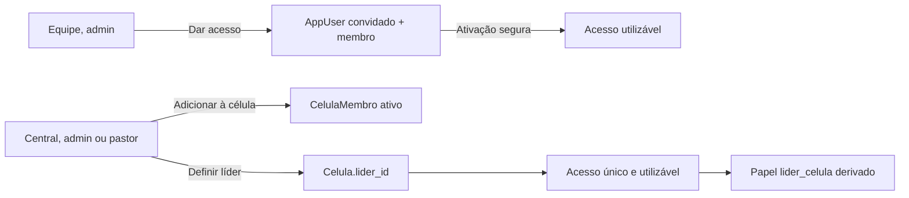

# Implementação local, Fatia 03: acesso, vínculo e liderança de célula

Data: 2026-08-11

Status: `PR RASCUNHO ABERTO`

Base: `8c9f91712352a2e85afc389114930a4f3cd72f3f`

Branch local: `codex/ux03-cell-access-leadership`

PR rascunho: [#250](https://github.com/haniellevi/PastorAI-LionClaw-V1/pull/250),
empilhado sobre a Fatia 02

Grafo: `NÃO COMPROVADO`; não havia manifesto/índice com raiz, commit, horário e
integridade demonstráveis. Decisões por leitura direta, testes e revisão
independente

## Objetivo

Separar três operações que a interface e o domínio antigo tratavam como uma só:

1. dar acesso ao painel;
2. vincular uma Pessoa a uma célula;
3. aprovar ou encerrar a liderança de uma célula.

A fatia não cria um novo módulo, não altera o banco e não executa reparo global.
Ela usa as relações existentes e fecha os caminhos que permitiam divergência ou
bypass entre acesso, papel e responsabilidade real.

## Contrato implementado

### Dar acesso

- somente administrador da igreja convida;
- o convite não recebe `celulaId` e nunca move a Pessoa;
- Pessoa já vinculada ou que já lidera pode receber acesso;
- convite novo começa com papel base `membro`;
- e-mail existente em qualquer igreja ou no Clerk é recusado;
- falha de consulta ao Clerk interrompe o convite, sem criar estado local;
- reenviar é permitido somente para convite realmente pendente;
- token revogado ou já ativado não reabre acesso.

Na ativação sem Pessoa explícita, o telefone serve apenas para criar uma Pessoa
nova. Se o telefone já pertence a uma Pessoa, a ativação falha antes do Clerk e
o administrador deve emitir um convite Parte A apontando explicitamente para o
cadastro correto. Telefone auto-informado não é prova de identidade.

### Adicionar à célula

- somente a Central, `admin` ou `pastor`, cria o vínculo direto;
- o fluxo escolhe uma Pessoa existente e não pede e-mail;
- a ação não cria conta nem papel de sistema;
- célula inativa ou sem líder não recebe membro;
- Pessoa já vinculada, pastor, líder ativo ou número oficial inelegível é recusado;
- célula, Pessoa e vínculo são relidos sob lock antes da escrita;
- `CelulaMembro` e o espelho legado `Pessoa.celula_id` mudam na mesma transação;
- Operador e Líder de Multiplicação veem apenas sua própria célula, quando houver
  vínculo canônico, e não enumeram endereço e liderança de toda a igreja.

### Definir liderança

- criar célula, trocar líder e ativar ou desativar ficam na Central;
- o candidato precisa estar apto, fora de CSIM e possuir exatamente um acesso
  utilizável na mesma igreja;
- acesso utilizável significa Clerk presente e status `ativo` ou `NULL` legado;
- a mesma Pessoa não assume duas células ativas novas;
- `lider_celula` não é editável em Equipe: nasce e termina com a liderança;
- se o papel derivado era o único papel ao encerrar a liderança, o acesso volta
  ao papel base `membro`;
- revogar o acesso de líder efetivo exige primeiro transferir ou encerrar a
  liderança;
- registros históricos com o mesmo líder preservam aptidão e CSIM antigos, mas
  qualquer edição reconcilia acesso técnico e papel derivado.

## UX entregue

### Equipe

- CTA `Dar acesso ao painel` separado da célula;
- busca de Pessoa existente ou cadastro de novo convidado;
- Pessoa em célula ou líder continua elegível ao acesso;
- mudar a busca limpa o alvo selecionado, evitando convite oculto à Pessoa
  anterior;
- `lider_celula` aparece bloqueado e explicado como responsabilidade derivada;
- revogação de líder e último administrador retorna orientação acionável.

### Central de Células

- única porta de criação de célula;
- seletor de líder cruza Pessoa e Equipe paginada;
- convidado, revogado, sem Clerk, sem acesso ou com acessos duplicados permanece
  visível com motivo e não pode ser escolhido;
- inconsistência técnica do líder atual bloqueia o salvamento; aptidão ou CSIM
  históricos aparecem como aviso cadastral não bloqueante;
- `Adicionar à célula` usa Pessoa existente e mantém o sucesso visível;
- mudar a busca limpa o alvo anterior;
- ação fica desabilitada, com motivo acessível, em célula inativa ou sem líder.

### Tela legada de Células

- deixa de criar célula;
- liderança e ativação são somente leitura;
- edição leve permanece conforme o escopo existente do backend;
- apenas admin e pastor veem `Adicionar à célula`.

## Segurança e concorrência

- liderança trava célula, Pessoas antiga e nova e acessos antes de sincronizar o
  papel;
- mutações de administrador e dono são serializadas por igreja;
- último administrador considera somente acesso utilizável, não convite ou
  revogado com papel residual;
- owner precisa continuar sendo administrador utilizável;
- todas as superfícies de convite compartilham a mesma trava advisory de e-mail
  e uma consulta global estreita, sem desmontar o RLS da sessão principal;
- criação de Pessoa por telefone usa a mesma advisory lock canônica em ativação,
  Pessoas e inbound do WhatsApp;
- criação Clerk que vence e falha no commit local recebe compensação best-effort;
- solicitação stale de transferência ou remoção revalida célula de origem,
  liderança, Pessoa e vínculo ativo antes da decisão;
- a tool `vincular_celula` do agente exige capacidade da Central tanto no runtime
  quanto na própria tool;
- papel para a tool vem de exatamente um acesso utilizável; convidado, revogado,
  sem Clerk ou duplicado falha fechado;
- o LLM não pode fornecer ou forjar `actor_roles`.

## O que permanece fora desta fatia

- novo tipo formal de solicitação `alterar_lider`, pois o enum/check atual exigiria
  migration e decisão de workflow;
- histórico completo antes/depois de cada mudança de liderança;
- reparo automático de dados legados;
- suporte de uma identidade Clerk a várias igrejas;
- decisão de produto sobre permitir célula ativa sem líder. O runtime atual
  permite o cadastro, mas bloqueia novos membros enquanto não houver líder.

## Auditoria pré-implantação

O arquivo
[`auditorias/03-acesso-lideranca-celula-readonly.sql`](auditorias/03-acesso-lideranca-celula-readonly.sql)
contém somente `SELECT`. Ele mede divergências legadas sem reparar ou escrever
dados. Em 2026-08-11 ele foi executado contra o banco DEV dentro de transação
`REPEATABLE READ READ ONLY`, encerrada com `ROLLBACK`.

Resultado DEV:

- `0` célula ativa sem líder;
- `0` líder sem papel derivado;
- `0` líder sem exatamente um acesso utilizável;
- `0` papel derivado sem liderança ativa;
- `0` pessoa liderando mais de uma célula ativa;
- `0` vínculo espelho divergente, convite legado de célula, acesso duplicado,
  dono inutilizável ou e-mail duplicado;
- `1` acesso sem papel ministerial, explicado integralmente pelo
  `platform_admin`; divergência não explicada: `0`.

Nenhum identificador ou nome do resultado foi gravado no repositório. Staging e
produção continuam dependendo de gate humano próprio.

## Validação consolidada

- Backend completo, repetido após a revisão da PR: `2265 passed`, `135 skipped`,
  `64 warnings`.
- Frontend completo: `83` arquivos e `694` testes aprovados.
- Typecheck e build de produção Next.js: `PASS`.
- `compileall` do backend e `git diff --check`: `PASS`.
- A revisão da PR encontrou quatro P1 reproduzíveis: vínculo da Parte B perdido
  com `autoflush=False`, reserva de e-mail não global, fixtures de concorrência
  inválidas e dois writers que aceitavam líder ativo como membro. Os quatro
  foram corrigidos antes desta consolidação.
- Re-revisão independente do diff combinado: `PASS`, sem P0/P1 reproduzível.
- PostgreSQL descartável real, com o mesmo driver do CI: suíte RLS
  `120 passed`, `7 deselected`; os dez casos antes vermelhos passaram `10/10`.
- Travas de `AppUser` compiladas como `FOR UPDATE OF app_users`, evitando lock
  indevido sobre o lado anulável do `LEFT JOIN` eager.
- Smoke autenticado DEV: login e Painel de Hoje validados para admin, pastor,
  líderes G12, consolidação, célula e multiplicação, operador e membro.
- Central de Células: admin validado em `360`, `390`, `414`, `768`, `1024` e
  `1440` px; matriz de papéis validada em `390` e `1440` px. Não houve overflow
  horizontal nem quebra de texto interno nos botões observados.
- Rotas restritas redirecionaram operador, membro, líder de consolidação e líder
  de multiplicação ao dashboard; pastor e líder G12 mantiveram suas superfícies
  autorizadas; nenhuma ação de escrita foi confirmada no smoke.
- Limite do ambiente DEV: Redis indisponível deixou o rate limit local em
  fail-open. As telas auditadas não produziram resposta `5xx`, mas esse ponto não
  prova a postura do ambiente implantado.

## Gate de aceite

Antes de merge:

1. `CONCLUÍDO`: auditoria DEV somente leitura e explicação das divergências;
2. `CONCLUÍDO`: smoke autenticado por papel, sem escrita de dados;
3. `CONCLUÍDO EM TESTES`: acesso, vínculo e liderança como ações separadas;
4. `CONCLUÍDO`: 360, 390, 414, 768, 1024 e 1440 px;
5. `PENDENTE DE PRODUTO`: decidir se célula ativa sem líder continua válida;
6. `PENDENTE DE NOVO GATE`: ready for review, merge, migration, deploy e produção
   continuam separados.
