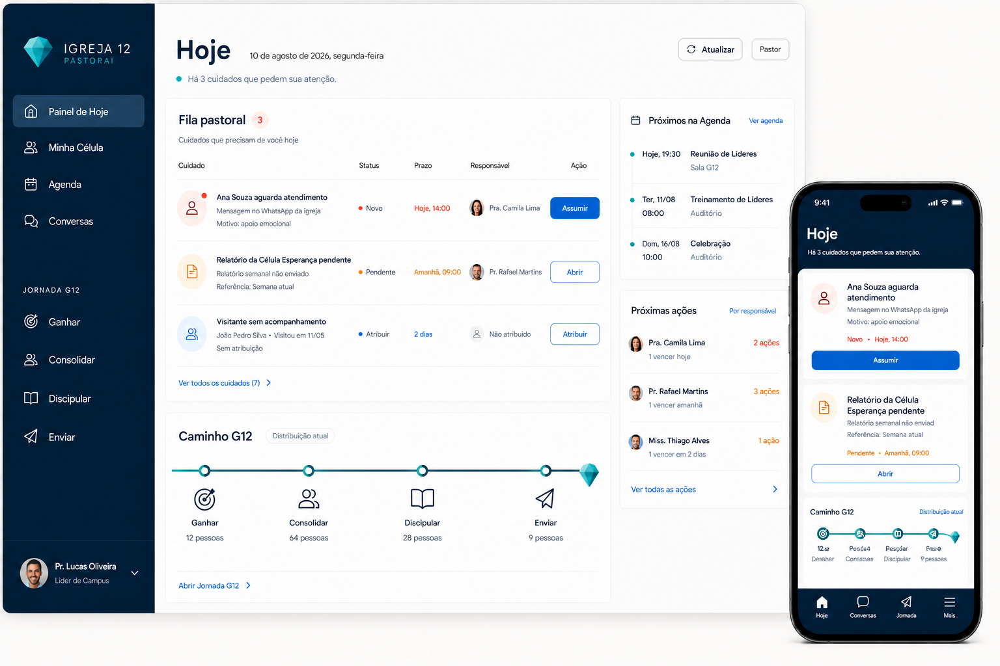
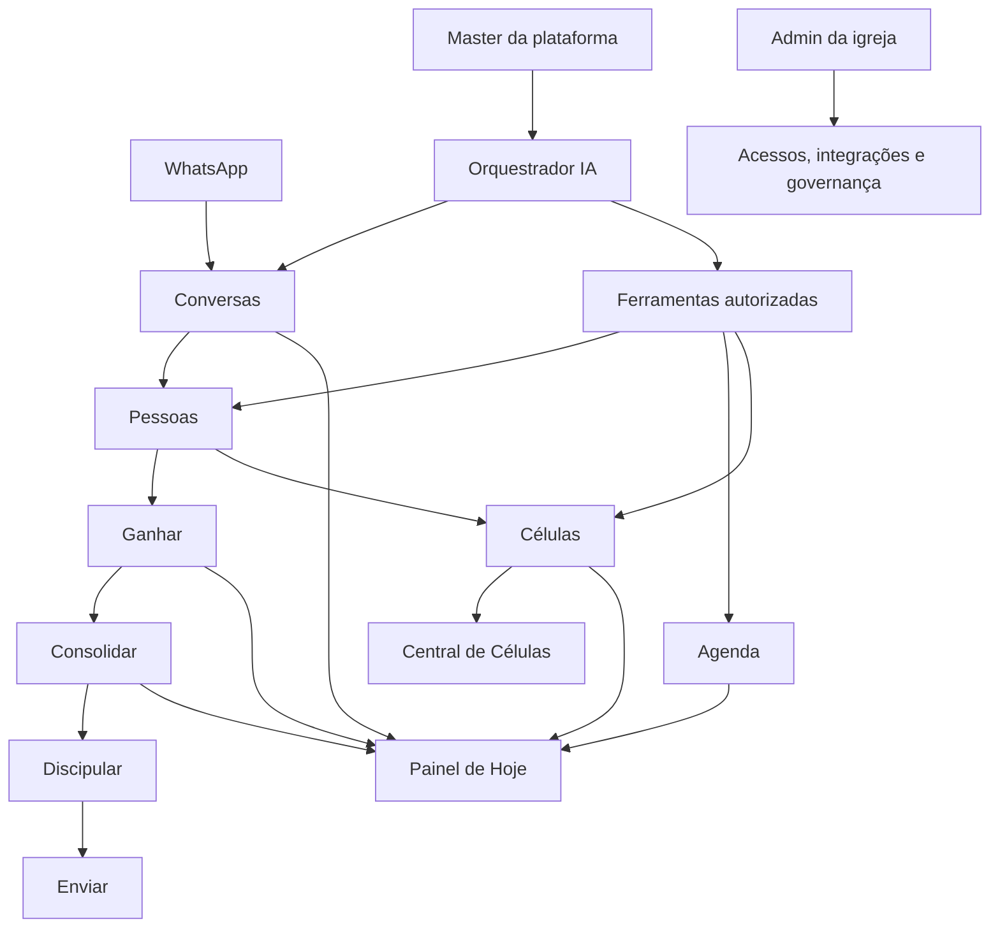

# Planejamento Mestre PastorAI / Igreja 12

## 1. Resultado esperado

Este plano integra o produto atual, os documentos históricos, as correções já realizadas e as novas necessidades do usuário. Ele não propõe voltar à versão antiga.

O sucesso futuro será:

- uma pessoa entende o que precisa fazer em menos de cinco segundos;
- cada papel vê somente dados e ações compatíveis com sua responsabilidade;
- WhatsApp transforma conversa em cuidado e fluxo rastreável;
- Agenda e Células alimentam a operação diária;
- Jornada G12 mostra posição, próximo passo e responsável;
- administração fica separada da experiência pastoral;
- interface é rápida, acessível, responsiva e humana;
- automação nunca esconde consentimento, escopo ou aprovação.

## 2. Definição do produto

O PastorAI / Igreja 12 é um sistema operacional pastoral multitenant.

Ele conecta:

- WhatsApp e conversas;
- identidade e histórico de Pessoas;
- Agenda e comunicação;
- Células e Central de Células;
- Ganhar, Consolidar, Discipular e Enviar;
- responsabilidades, acessos e administração;
- um orquestrador de IA por igreja, sob governança da plataforma.

O produto não é:

- um CRM genérico;
- um chatbot solto;
- um painel de métricas sem tarefa;
- uma rede social da igreja;
- um editor de prompts aberto a qualquer usuário;
- um substituto do cuidado humano.

## 3. Norte de experiência

### Clareza pastoral

Cada tela responde:

1. onde estou;
2. o que precisa de atenção;
3. por que isso importa;
4. qual ação posso realizar;
5. quem assume depois.

### Responsabilidade antes de papel

O menu e o dashboard são compostos por capacidades e escopos. Um título de liderança não concede acesso global.

### Acolhimento sem infantilização

Linguagem humana, estados vazios úteis, microinterações discretas e sucesso compreensível.

### Automação honesta

Registrar intenção não é enviar. Aceite do provedor não é entrega. Inferência não é fato. Rascunho não é publicação.

### Progresso visível

Jornada G12, onboarding, reunião, cadastro e atendimento mostram etapa, próximo passo e responsável.

## 4. Direção visual

**Direção recomendada:** Farol de Hoje sobre Diamante Lapidado.

- base marinho mineral e superfícies gelo do sistema atual;
- ação primária permanece azul Diamond;
- teal pode ser testado como acento pastoral, nunca como segundo primário sem validação;
- Sora em títulos e Plus Jakarta Sans no corpo;
- densidade compacta em filas, confortável em formulários;
- diamante usado como marca, não ornamento repetitivo;
- Jornada G12 como caminho vivo funcional;
- uma hierarquia clara, sem grade de cards uniformes.

O texto desta imagem é conceitual. A especificação determinística está nos documentos desta pasta.

## 5. Arquitetura do produto

## 6. Superfícies

### App pastoral

Para membro, líder, pastor e admin em operação:

- Painel de Hoje;
- Minha Célula;
- Agenda;
- Conversas, quando autorizadas;
- Jornada G12;
- áreas da responsabilidade atual.

### Admin da igreja

- Configuração Inicial;
- Pessoas administrativas;
- Equipe e acessos;
- Permissões;
- Identidade;
- WhatsApp;
- Agente IA;
- Calendário;
- Assinatura, somente owner.

### Painel master

- igrejas;
- planos e cobrança global;
- template e versões do agente;
- governança e suspensão;
- auditoria operacional da plataforma.

## 7. Modelo de Pessoa e acesso

Separar quatro conceitos:

| Conceito | Exemplo |
|---|---|
| Pessoa | Maria, visitante e depois membro |
| Usuário | login de Maria no painel |
| Responsabilidade | líder de uma célula ou ministério |
| Vínculo | célula, líder, discípulos e cobertura |

O estado atual já separa parte desses conceitos, mas convite, célula e papel ainda entram em conflito.

Regras alvo:

- contato e visitante podem ficar sem vínculo temporariamente;
- membro ou discípulo precisa de célula ou liderança explícita, salvo exceção formal;
- dar acesso não move a pessoa de célula;
- liderança não existe sem acesso válido;
- papel de líder não existe sem liderança efetiva;
- `Fora da igreja` continua separado do tipo ministerial.

## 8. Painel de Hoje

O painel é montado por responsabilidades acumuladas.

### Pastor/admin operacional

- pendências pastorais;
- conversas aguardando humano;
- pessoas em risco ou sem próximo passo;
- Agenda e confirmações;
- saúde de células;
- visão da Jornada G12.

### Líder de célula

- próxima reunião;
- planejamento e relatório;
- visitantes e discípulos da própria célula;
- avisos da igreja e da Central;
- agenda da semana;
- nenhuma fila pastoral global.

### Líder de ministério

- agenda e tarefas da responsabilidade;
- pessoas atribuídas;
- avisos específicos;
- visão pública da igreja.

### Membro

- próximos eventos;
- avisos da igreja e da célula;
- Minha Célula;
- próprios dados e caminhada;
- conteúdo de formação disponível;
- nenhuma ação sobre terceiros.

## 9. WhatsApp e agente

### Propósito operacional

1. reconhecer ou criar contato;
2. acolher e entender intenção;
3. obter consentimento adequado;
4. atualizar dados progressivamente;
5. encaminhar cuidado;
6. manter humano no controle de casos sensíveis;
7. oferecer ferramentas tenant-safe.

### Estado atual a preservar

- ingestão idempotente;
- contato inicial;
- conversa persistida mesmo quando o modelo falha;
- opt-out;
- pausa para CSIM;
- orquestrador por igreja;
- LangGraph;
- Evolution;
- broadcast com ledger e gates.

### Ainda falta

- workflow cadastral retomável;
- revisão semestral;
- campos pastorais completos;
- consentimentos por finalidade;
- CSIM com revisão segura;
- memória conversacional persistente;
- RAG documental com ACL;
- ferramentas de consulta ao vivo mais amplas;
- owner para credencial, modelo e WhatsApp;
- entrega real comprovada para eventos e avisos.

## 10. Pessoas e Jornada G12

### Ganhar

Primeiro contato, visitante, decisão, origem, responsável e próximo passo. Hoje existe, mas o escopo por responsabilidade é o maior gap de segurança.

### Consolidar

Fila, prazo, contato, resultado e acompanhamento. Líder de célula acompanha somente discípulos explicitamente sob seu cuidado.

### Discipular

Árvore, célula, formação e desenvolvimento. Ascendência mostra dados mínimos; descendência usa escopo confirmado.

### Enviar

Conteúdo educativo seguro para quem ainda não possui ação operacional. Dados de pessoas e equipes ficam restritos.

### Formação

Universidade da Vida e Capacitação Destino exigem projeto próprio com visão de aluno, líder e direção. Não entrar como tela vazia para preencher o roadmap.

## 11. Agenda

O produto atual já possui Semana, Mês, Ano, A confirmar, CRUD básico, importação Google e configuração de intenção de notificação.

Prioridades:

- completar local, responsável e recorrência;
- decidir Mês versus Semana como abertura;
- padronizar evento pendente com ícone e texto;
- adicionar Planejamento somente após validação;
- separar aviso interno e comunicação do evento;
- implementar outbox antes de prometer envio;
- tratar Google como importação unidirecional até existir conflito bidirecional.

## 12. Células

### Minha Célula

Já existem visões reais de discípulo e líder. Preservar presença, visitante, avisos, materiais, histórico, planejamento e relatório.

Completar:

- hero e contexto do membro;
- planejamento mais rico e retomável;
- adicionar participante sob guards;
- visitante com telefone e decisão integrado a Pessoas/Ganhar;
- alerta de relatório atrasado;
- visual e densidade autenticados.

### Central

Já existem dashboard, gestão, saúde, pendências, solicitações, avisos, materiais e multiplicação.

Completar:

- campos ricos já aceitos pelo backend;
- confirmação antes de aprovar impacto;
- payload completo de multiplicação;
- nova liderança sincronizada com acesso;
- transferência e saída ponta a ponta;
- KPIs validados;
- comunicação real separada de intenção.

## 13. O que falta primeiro

### P0, autorização e responsabilidade

1. Ganhar, Pessoas, células e fila não podem retornar tenant inteiro a líder limitado.
2. Vínculo de célula precisa de capacidade de domínio.
3. Transferência de conversa precisa consultar matriz efetiva.
4. Dashboard precisa filtrar tarefa por responsabilidade.

### P0, consistência de liderança

1. convite sem mover célula;
2. líder com acesso válido;
3. papel sincronizado com liderança real;
4. aprovação atômica e auditada.

### P0, comunicação e consentimento

1. finalidades separadas;
2. owner/admin principal;
3. outbox e idempotência;
4. smoke Evolution e workers;
5. linguagem de entrega correta.

### P1, experiência

1. dashboard por responsabilidade;
2. alinhamento visual de Minha Célula e Agenda;
3. contratos ricos já existentes;
4. fluxo cadastral do WhatsApp;
5. Jornada escopada e educativa.

## 14. O que pode ser melhor trabalhado sem mudar a direção

- reorganizar telas longas por tarefa, sem remover funcionalidades;
- usar linhas e seções em vez de novos cards;
- corrigir padding e largura de conteúdo;
- impedir quebra interna de botões;
- reforçar estados de módulo desativado, offline e permissão;
- tornar confirmações de alto impacto explícitas;
- mostrar progresso e rascunho;
- alinhar frontend aos campos já presentes no backend;
- reutilizar os componentes `ds` antes de criar novos;
- usar o diamante e caminho G12 com função.

## 15. Piloto recomendado para Filadélfia

### Piloto imediato mais seguro, após smoke

**Agenda + Central de Células, sem envio automático.**

Usos:

- organizar eventos;
- importar Google como pendente;
- confirmar informações;
- cadastrar e acompanhar células pela Central;
- planejar e relatar reuniões;
- usar avisos e materiais dentro do app.

### Segundo recorte

**WhatsApp inbound + Conversas + Ganhar básico.**

Usos:

- receber primeiro contato;
- criar contato básico;
- transferir para humano;
- classificar CSIM com revisão;
- registrar próximos passos já suportados.

### Ainda não prometer

- cadastro semestral completo;
- comunicação automática de Agenda;
- criação de célula pelo orquestrador;
- assistentes pessoais separados;
- memória/RAG;
- formação completa;
- Discipular profundo;
- publicação editorial automática.

## 16. Oportunidades futuras

Fora do wireframe principal e do V1 atual:

- busca global com autorização;
- timeline pastoral compreensível;
- importação assistida de Pessoas;
- RAG documental com fontes;
- assistentes especializados por função;
- Meta Cloud API direta;
- multiprovedor de IA;
- sync Google bidirecional;
- Universidade da Vida e Capacitação Destino completas;
- telemetria de usabilidade com minimização e LGPD;
- automação editorial com revisão.

## 17. Roadmap

Ordem resumida:

1. capacidades e escopos;
2. liderança e acesso;
3. fundação visual aprovada;
4. dashboard por responsabilidade;
5. Pessoas e Jornada escopadas;
6. Minha Célula e Central;
7. Agenda;
8. cadastro WhatsApp;
9. governança e comunicação real;
10. responsabilidades customizadas;
11. conhecimento documental;
12. formação e Jornada profunda.

Detalhes em [08-ROADMAP-PRIORIZADO.md](08-ROADMAP-PRIORIZADO.md).

## 18. Critérios de aceite

- autorização comprovada no backend;
- experiência por papel e responsabilidade;
- 360, 390, 414, 768, 1024 e 1440 pixels;
- teclado, foco, contraste, zoom e leitor de tela;
- loading, vazio, erro, sucesso, offline, permissão e flag desligada;
- Core Web Vitals medidos em campo;
- screenshots antes e depois;
- smoke autenticado;
- nenhuma mensagem real sem gate;
- nenhuma mudança de produção inferida por aprovação visual.

## 19. Estado desta entrega

- planejamento integrado: concluído;
- pasta e acervo: concluídos;
- código do produto: não alterado;
- migrations e infraestrutura: não alteradas;
- produção: não alterada;
- direção visual: recomendada, ainda aguardando aprovação explícita;
- próxima etapa segura: smoke autenticado READ-ONLY ou revisão do planejamento.
