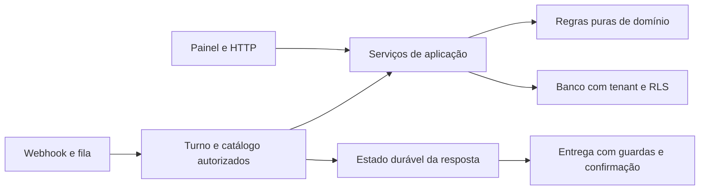

# Igreja12: plano único de desenvolvimento e refatoração

Fonte técnica única da refatoração e dos ambientes. Consolidado em 09/10/2026 a partir dos planos e pareceres anteriores e dos candidatos dos PRs #461, #462 e #463. Este documento descreve decisões, ordem, critérios de aceite e limites de validação; não implementa correções nem opera ambientes. O estado vivo de cada tarefa (estado, evidências, próxima ação) fica em [`docs/ops/acompanhamento/`](acompanhamento/README.md), que é uma visualização deste plano, não um segundo plano.

Os pareceres de apoio da revisão (matriz de decisões, inventário de cobertura, revisões dos PRs) não foram versionados: servem de evidência e não são normativos. As propostas retiradas ou adiadas estão resumidas no apêndice.

## 1. Decisão e resultado esperado

Manter o monólito modular no repositório atual. Corrigir dependências por fatias pequenas, colocar o fluxo integrado sob teste e preparar DEV isolado com publicação automática. PROD recebe uma publicação explícita da revisão validada. A migração Supabase para Neon permanece cancelada.

Princípio: extrair uma responsabilidade quando isso reduz o esforço de uma mudança real, preservando comportamento, autorização, transações e recuperação. Novas pastas, um arquivo por ação e redução de linhas não são critérios de sucesso.

O resultado esperado é conseguir editar, testar, validar pelo navegador e publicar uma versão identificada com menos trabalho repetido. Medir tempo até o primeiro teste útil, duração/espera do CI, ações manuais até DEV/PROD e dispersão de uma mudança entre módulos. Registrar uma linha por fatia; nenhum ganho percentual ou prazo está comprovado na revisão de 09/10.

## 2. Base e alcance da revisão (fotografia inicial)

- Checkout principal do proprietário: branch `chore/neon-dev-setup`, HEAD `4962c05e073e833bfba92e05e04043e32a1db35b`, com alterações locais preservadas. Na revisão inicial, as fontes de produto examinadas eram iguais às de `origin/main` local `d36ab813bf45f8bc92fd605425394570e85ad3ec`. A atualização acrescenta os objetos dos PRs identificados abaixo.
- Os dois anexos arquiteturais iniciais são idênticos, com SHA-256 `8b8b58325124809bb78174867cc2254ea9f4887198c9c945aa29fe50b3b778c8`. O terceiro anexo é um parecer sobre os PRs #461/#462; suas conclusões foram novamente conferidas.
- Candidatos adicionais: [#461](https://github.com/haniellevi/PastorAI-LionClaw-V1/pull/461), HEAD `bed02fabfb43588e2fa7963727f5d4b9ee96a28c`, documentação; [#462](https://github.com/haniellevi/PastorAI-LionClaw-V1/pull/462), HEAD `08e8928216da35040b3d3cc5f08edb9ca62d3b8b`, simulador/transporte. Ambos foram revisados abertos sobre a base `d36ab813bf45f8bc92fd605425394570e85ad3ec`. Implementação em candidato não significa integração na main, stack validada ou DEV disponível.
- A preparação de dependências agora tem candidato [#463](https://github.com/haniellevi/PastorAI-LionClaw-V1/pull/463), HEAD `9f61ba5e087b60d4336d21ed2d025996dff2cdc3`, sobre a mesma base. Quatro checks de produto, audits e build Docker backend aprovados no CI. A revisão não identificou bloqueador no diff. Reconferido na execução de 09/10: o PR segue aberto e mergeável, com os quatro checks de produto e `tooling-static` aprovados nesse SHA, e a `main` continua em `d36ab813`. Integração pendente; ela depende de autorização do proprietário.
- Inventariados os 1.540 caminhos rastreados e os 46 não rastreados não ignorados. Houve varredura programática integral de 1.361 textos permitidos, incluindo 531 arquivos Python analisados por AST, sem importar a aplicação. A leitura semântica concentrou-se nas propostas, seus consumidores e testes; os inventários por frente distinguem leitura integral, regiões e varredura estrutural.
- Segredos, exemplos de ambiente protegidos, dados, binários e artefatos gerados receberam exclusão ou classificação por metadados. A revisão não afirma leitura semântica de cada linha do repositório nem inspeção de dependências instaladas.
- DEV/PROD vivos, configuração efetiva da Vercel, proteção remota de branch, recursos/custos e desempenho continuam sem verificação operacional direta. Audits dos PRs reportam dependências herdadas da `main`, bloqueando `backend-tests` e `frontend-ci` antes das respectivas suites. A última execução própria desse SHA na `main`, em 02/10 às 16:24 BRT, passou em [backend](https://github.com/haniellevi/PastorAI-LionClaw-V1/actions/runs/37053884548) e [frontend](https://github.com/haniellevi/PastorAI-LionClaw-V1/actions/runs/37053884518). Não foi iniciada nova execução; evitar registrar que a última execução da `main` falhou.
- Sinal operacional consultado em 09/10: os três últimos `Production monitor` agendados falharam em `api-readiness`, com `HTTPError`; os outros oito checks passaram. Inícios em BRT: [08/10 20:57](https://github.com/haniellevi/PastorAI-LionClaw-V1/actions/runs/37862292229), [09/10 03:11](https://github.com/haniellevi/PastorAI-LionClaw-V1/actions/runs/37892253023) e [09/10 10:19](https://github.com/haniellevi/PastorAI-LionClaw-V1/actions/runs/37936062411), todos em `d36ab813`. Isso exige triagem própria, sem atribuir causa, código HTTP específico ou falha total de PROD. Foram lidos registros do GitHub, sem sondagem, deploy ou intervenção em PROD. Reconferido na execução de 09/10, também só pelos registros do GitHub: o histórico é maior que os três últimos. As 27 execuções agendadas mais recentes do `Production monitor`, a partir de 03/10 às 16:19 UTC, concluíram em falha, e as anteriores (até 03/10 às 12:03 UTC) passaram. No último schedule, o único passo reprovado é “Fail workflow when production is unhealthy”, no job `public-health`. A janela começa um dia depois da última execução própria da `main` (02/10). Isso é um sinal sem causa determinada; a triagem continua pendente e separada da sequência principal.

## 3. O que aproveitamos e o que retiramos

| Tema | Decisão consolidada |
|---|---|
| Estrutura | Aproveitar `domain`, `services`, routers, workers e adaptadores existentes. Extrair sob demanda; nenhum renomeio em massa ou camada de repositório universal. |
| Primeira extração de domínio | Extrair validação pura de visitante, cobrindo propostas, serviço ministerial e parser do catálogo. Preservar os contratos humano e WhatsApp. Corrigir dependências e concluir reparos dos candidatos existentes antes, conforme seção 9. |
| Simulador | Dividir em F2a, transporte/contrato já candidato no #462, e F2b, prova integrada ainda pendente. F2a requer correções de código e descrição; não basta renomear o PR. A extração pura inicial pode avançar independentemente. |
| Ambientes | DEV isolado, dados sintéticos, provedores simulados, versão identificada e reserva curta de aceite. Stack local permanece disponível para depuração e migrations locais; não precisa rodar inteira a cada edição. |
| Release | Separar preparação do DEV, preparação do release e execução de PROD. Resolver compatibilidade entre checkers, schema e versões; migrar antes de iniciar código dependente. |
| Regras compartilhadas | Reutilizar `ensure_active_membro`, serviços ministeriais, outbox e `/auth/bootstrap`. Não recriar funcionalidades já presentes. |
| Ações do agente | Conservar catálogo e contratos fechados. Adiar registro genérico e relaxamento do CHECK até existir necessidade demonstrada e prova de compatibilidade. |
| Configuração | Centralizar leitura e diagnóstico gradualmente, preservando configuração tardia de integrações desligadas, gates específicos e ativação por igreja. |
| Testes | Manter comportamento, privacidade, RLS, concorrência e recuperação. Substituir testes estruturais um a um quando equivalente comportamental estiver identificado. |
| Código histórico | Preservar frentes pausadas e componentes com consumidores. Falta de referência textual, flag desligada ou uso de hash não basta para remoção. |
| Limpeza | Trilha separada, recuperável e nominal, incluindo reflogs e objetos. Não condiciona o desenvolvimento nem autoriza descarte dos totais inventariados. |

O apêndice A resume as propostas retiradas ou adiadas.

## 4. Arquitetura mínima e contratos preservados

Routers traduzem HTTP e resolvem autenticação; workers coordenam fila, lease, recuperação e execução. Agente seleciona intenções e ferramentas permitidas. Serviços de aplicação realizam a operação de negócio com identidade e igreja confiáveis; regras puras não importam banco, HTTP, agente ou worker. Serviços acessam persistência e adaptadores quando necessário, sem criar abstrações genéricas para cada query.

Áreas de responsabilidade: identidade e acesso; pessoas/células/reuniões; consolidação; agenda/relatórios; conversas/atendimento; agente/propostas; integrações; cobrança/plataforma. São fronteiras conceituais, sem obrigação de criar dez pacotes agora.

Contratos que permanecem:

1. Tenant, identidade, papel, vínculo e capacidade vêm do servidor. Autorização inicial não substitui revalidação dentro da transação nem imediatamente antes do efeito externo. Preservar os dois mecanismos atuais de escopo de sessão até uma fatia própria comprovar equivalência.
2. Painel e agente compartilham serviços, mas políticas diferentes por canal permanecem explícitas. O humano pode ter contrato de nome, observação e reunião passada diferente da ação própria pelo WhatsApp. Refatoração não decide essas diferenças por acidente.
3. Proposta, resumo, confirmação, prazo, vínculo e idempotência continuam acoplados por seu contrato funcional. Efeito de domínio, estado executado e recibo são persistidos na mesma transação; resposta entregue somente após commit. Visitante conserva parsing determinístico e privacidade do nome, sem projetá-lo ao LLM.
4. Preservar estados persistidos, ownership, lease, exclusão mútua e classificação de resultado ambíguo. Timeout depois de um envio possivelmente aceito não autoriza reenvio indiscriminado.
5. Opt-out global prevalece. Elegibilidade de comunicação depende também de finalidade, canal, estado e gates; uma função universal `pode_contatar()` não deve apagar essas diferenças. Unificar predicados puros somente quando forem equivalentes.
6. As credenciais continuam OpenAI BYO por igreja. Conversas são privadas e não alimentam conhecimento institucional automaticamente. Memória durável, RAG, UV/CD e governança pausada não entram nesta refatoração.
7. O painel continua usando contratos de API e snapshot remoto de permissões. Matriz de navegação não concede automaticamente acesso a dados ou execução de ação. Preservar cache por sessão, recusa de sessão inválida e contratos de paginação/inbox.

## 5. Sequência única de execução

Uma fatia de produto por vez. Ordem de entrega: dependências → documentação #461 → `test-local.sh` → correções do #462 (F2a) → visitante (F1) → F2b → F3 → preparação F4 → F5. Os identificadores das fatias foram preservados para rastreabilidade; a ordem reconhece o simulador já candidato. Não há execução paralela de F1/F2a prevista. Cada entrega fecha seu resultado observável antes da próxima, com PR pequeno, quatro checks e registro curto. Revisão independente permanece para autenticação/RLS e migrations de produção.

### Preparação inicial. Corrigir dependências herdadas da base

Estado: implementada no candidato #463 e validada pelo CI, incluindo imagem Docker e PG/RLS; ainda sem merge ou deploy na revisão de 09/10. O lock altera LangGraph para 1.2.14, prebuilt para 1.1.0 e SDK para 0.4.6; frontend corrige sharp/source-map-js. Os avisos moderados do Next permanecem em patch próprio. O audit aprovado omite dependências dev; `npm ci` ainda relata oito altas no grafo completo, contra dez na base, exigindo triagem separada. Não declarar zero vulnerabilidades. Conservar o candidato existente; não refazer o trabalho já verificado.

Primeiro patch, em PR próprio: corrigir as vulnerabilidades dos manifests/locks herdados da `main` que hoje reprovam os audits dos candidatos. A última execução própria da `main` `d36ab813` em 02/10 passou; isso não comprova aprovação com os advisories atuais. A origem compartilhada das dependências está confirmada, enquanto uma nova execução da `main` não foi disparada na revisão de 09/10.

Reconferir advisories, versões corretivas e compatibilidade na execução, atualizar somente o necessário e preservar os audits. Aceite: auditorias e quatro checks aprovados no candidato corrigido, sem desativar verificações ou atribuir PASS a suites que ficaram sem executar. Depois de integrar essa correção pelo fluxo autorizado, atualizar a base dos PRs #461/#462 e revalidá-los no novo SHA. Não fazer upgrade indiscriminado nem misturar a correção à implementação do simulador.

### F0. Corrigir a entrada de trabalho e o falso sucesso dos testes

Dois patches separados, primeiro documentação no #461, depois script. Reconciliar instruções ativas: registrar o DEV automático como alvo planejado até sua demonstração, retirar exigência genérica de conselheiros por fatia e referências ativas à migração Neon cancelada. `CLAUDE.md` já importa AGENTS e a descrição da Sarah já está restrita; preservar essas mudanças do proprietário. Há resíduo Neon no guia local não rastreado `CONFIGURACAO-DESENVOLVIMENTO.md:125` (arquivo do proprietário fora do Git); corrigir pontualmente, sem versionar outros arquivos locais por arrasto. Essa correção é um item do proprietário e não faz parte do PR.

O #461 adiciona este arquivo, já referenciado por AGENTS, CLAUDE e MVP. Em 09/10 seu conteúdo anterior (propostas descartadas na consolidação) foi substituído por este plano, com links portáveis para o repositório e o GitHub. Este caminho é a única fonte técnica versionada; os pareceres de apoio não são normativos. A sprint do Passo 0 e os trechos do MVP sobre DEV foram atualizados junto, para não deixar instruções contraditórias. Os históricos não foram reescritos e nenhum teste congela texto. A ordem de entrega não cria aprovação adicional para cada edição local reversível. O acompanhamento visual (seção 10) entrou no mesmo PR.

O patch de `test-local.sh` rejeita alvo desconhecido com saída não zero antes de executar qualquer ferramenta, mantendo `todos`, `backend` e `frontend`. A reprodução desta revisão confirmou que o script atual retorna 0 sem testes para alvo inexistente. Encaminhamento de argumentos e seleção rápida são melhoria posterior, com sintaxe explícita; não aumentar a correção para criar uma CLI nova.

Aceite: comando inválido falha de forma compreensível; comandos válidos preservam seleção e versões. A entrada operacional aponta para uma única sequência e distingue ambientes planejados dos disponíveis. Reversão por revert sem dados ou migrations.

### F2a. Concluir transporte simulado e contrato do fake

Reaproveitar o candidato #462: Evolution falsa, chat, modo `WHATSAPP_TRANSPORTE=simulado`, compose local e testes de contrato/handler com PostgreSQL. A configuração mantém o gate global fechado e seleciona URL/chave próprias para o fake. Nenhuma ação privilegiada nova faz parte dessa fatia.

Antes de concluir, corrigir o validador de destinos: `host.startswith("127.")` aceita domínios como `127.example.invalid`; o fallback sem ponto também aceita IPv4 numérico alternativo. Para IP literal, usar `ipaddress.ip_address` e exigir `is_loopback`. Quando não for IP literal válido, aceitar somente o nome exato da lista abaixo. Recusar nomes numéricos, hexadecimais ou outras formas alternativas, sem entregá-los ao resolvedor como nomes de serviço. Não usar resolução DNS permissiva como validação.

| Sentido | Nomes permitidos além de IP literal loopback |
|---|---|
| Backend → Evolution falsa | `localhost`, `simulador-whatsapp` |
| Simulador → webhook backend | `localhost`, `backend` |

Aceitar apenas HTTP(S), host normalizado e porta válida do serviço configurado; recusar credenciais embutidas. No compose local atual, usar loopback, com portas padrão 8090/8000 e seus overrides de desenvolvimento. Os nomes dos serviços só valem na topologia em que apontem aos componentes sintéticos esperados, inclusive transporte em memória nos testes. A lista não autoriza qualquer nome sem ponto ou host privado; manter rede restrita. Testar nos dois sentidos `127.example.invalid`, `0x7f000001`, `2130706433`, `167772161`, IPv4 não loopback e nomes ausentes da lista. Na conferência local, o parser IPv4 do sistema interpretou `0x7f000001` e `2130706433` como `127.0.0.1`, e `167772161` como `10.0.0.1`. Recusar todas essas formas evita interpretações distintas entre validação e transporte.

Corrigir o estado do fake: excluir uma instância hoje remove o registro e a ausência volta a significar `open`. A exclusão deve permanecer offline/ausente até recriação. Endpoints anunciados como suportados devem respeitar desconexão, incluindo mídia, ou ficar explicitamente fora do contrato.

Precisar gates e evidências. Brevo depende de `BREVO_SEND_MODE`, independentemente de `ALLOW_REAL_SENDS`; exigir modo `off` na configuração sintética, com gates global e financeiro fechados. O dispatcher de `notification_outbox` revalida o gate global antes do transporte e pode cancelar pendências com `gate_fechado`; não registrar que ele passa a enviar ao fake apenas porque o cliente permite chamadas diretas. Gates de geração/mutação não comprovam ausência total de rede, pois validação de credencial e certas leituras de provedores têm contratos próprios. A prova sem rede precisa conter egress e usar credenciais sintéticas.

Consequência para DEV: F2a não permite aceitar lembretes/avisos da outbox com gate global fechado. Quando esse cenário entrar no escopo, definir uma fatia própria de simulação sob isolamento e testar os gates por finalidade; não abrir o gate geral como atalho. Também no DEV sintético, fechar o gate e continuar consumindo pode cancelar itens, em vez de preservá-los para retomada.

Aceite de F2a: URL adversarial recusada nos dois sentidos; `APP_ENV=production` recusa simulação; chave real não reutilizada; contrato conectar/desconectar/excluir/enviar coerente; webhook autenticado e segredo incorreto recusado; texto e erro programado observados no fake; transporte real preservado. Verificar gates por chamador, sem liberar outbox ou demais provedores para ampliar essa fatia.

Corrigir corpo do PR, docstring, sprint, guia e checklist MVP. O teste PG atual prova handler, respostas determinísticas e persistência; usa fila em memória, dedupe Redis substituído, schema ORM sem policies e consulta direta de mensagens. Ainda não prova Redis, RLS, ação privilegiada nem API/browser do inbox. Preservar `rls_integration` enquanto necessário à seleção do job PostgreSQL, documentando seu alcance. Separar o item concluído de transporte do item pendente de prova integrada; não marcar o requisito original inteiro como entregue.

Reversão: revert da fatia e retorno ao transporte real com gate fechado, removendo somente a infraestrutura de simulação. F2a já existe como candidato e não precisa ser refeita ou artificialmente adiada até F1.

### F1. Validação de visitante no domínio

Extrair somente `canonical_visitor_name` e um erro puro para módulo de domínio adequado. Atualizar três caminhos: `agent_action_proposals`, `ministerial_actions` e `agent_privilege_catalog.own_visitor_command`; manter adaptador de compatibilidade quando necessário. Traduzir erro nas bordas, conservando `ProposalContractError` e HTTP 422 externos.

Preservar tipo estrito, trim, limite de tamanho, Unicode/controles, privacidade do erro e comportamento humano existente. Não alterar reunião, vínculos, autorização, locks, schema, enum ou flags.

Aceite: o serviço ministerial deixa de importar propostas do agente; entradas aceitas/recusadas e fluxos de proposta/SIM continuam iguais. Testes puros e regressão de visitante/propostas/humano, com cobertura PG existente no CI. A nova prova integrada não é pré-requisito para escrever essa mudança pura. Reversão por revert sem migration.

### F2b. Provar uma fatia integrada com Redis e RLS

Usar F2a corrigida para uma ação vertical concreta, começando pelo visitante. O fluxo atravessa webhook autenticado, Redis real, consumo pelo worker, roteador/catálogo e autorização reais, serviço e banco criado pelas migrations aplicáveis com policies verificadas, resposta persistida, entrega no fake e leitura pela API autenticada/painel.

A base integrada tinha somente PostgreSQL no job `rls-integration`. O candidato local agora acrescenta Redis 7.4 descartável por digest, com prontidão; a prova local usa fila real e keys isoladas por teste. A configuração nova ainda não rodou no GitHub. A primeira prova pode executar `QueueWorker.run` numa thread do processo de teste, passando por `WebhookQueue.enqueue`, `claim`, `ack` e leases reais, sem `_FilaMemoria`, Redis falso ou chamada direta de `handle_envelope` que contorne a fila. Usar sinais observáveis com prazo para prontidão/ACK; propagar falhas da thread e garantir `stop`/`join` limitado e fim do heartbeat em cleanup. Evitar sleeps arbitrários. Essa prova não demonstra boot, rede e supervisão entre processos, que ficam no smoke da stack real em F3. Processo separado não é requisito inicial de F2b.

Adicionar provedor LLM determinístico somente no limite externo. Ele não concede tenant, papel ou autorização; cadastro e credenciais são sintéticos. Não depender de crédito/provedor real ou Asaas sandbox. Caso um gate precise abrir dentro do teste isolado para exercer o provedor falso, comprovar contenção de destinos e saída de rede, sem bypass global de produção. Isso não é necessário para a entrega mais estreita F2a.

Aceite: ação própria autorizada por vínculo e membership, recusada após revogação; API de gestão recusada sem papel; dois tenants com controles positivos e recusa cruzada sob policies reais; consentimento e opt-out; replay sem efeito duplicado; revogação entre proposta e SIM; falha antes do commit com efeito/recibo atômicos; resposta recebida no fake e visível pelo caminho autenticado do painel.

Manter a fatia pequena: primeiro tornar reproduzível esse percurso; mapear e reutilizar testes existentes de assinatura, piloto, agente inativo, retry, resultado ambíguo, lease e ownership. Acrescentar lacunas em incrementos delimitados, sem reimplementar toda regressão no mesmo E2E. Antes de F5, os cenários de entrega que sua extração pode afetar precisam estar cobertos no nível apropriado.

Não chamar TestClient, marcador ou presença de PostgreSQL de prova da fronteira que ficou substituída. Conservar suites atuais e acrescentar a prova no CI de produto. Reversão retira o novo harness sem apagar testes anteriores.

### F3. DEV online isolado e publicação automática

Depois da escolha de região, teto de custo e executor, provisionar recursos próprios de banco/Storage, Redis, autenticação e segredos. Preferir API e banco próximos para reduzir latência; medir antes de atribuir benefício à modularização. O DEV histórico somente pode ser reutilizado após verificação de identidade, ausência de dados reais e isolamento.

Usar artefatos imutáveis do SHA integrado com checks verdes. O compose local atual usa bind mounts, rede e portas do host; não deve ser copiado como configuração de publicação. O candidato local empacota `scripts/migrate.py` e suas dependências na imagem do mesmo SHA, com allowlist de contexto; o alvo development acrescenta o simulador e a entrada de seed DEV, sem scripts protegidos. Seed nominal exige projeto DEV, TLS e gates fechados e preserva as recusas do CLI local. Build local não prova disponibilidade do recurso remoto. O executor físico e o workflow ainda dependem da T08.

Ordem: obter artefatos e verificar identidade/versão; assegurar contenção apropriada dos consumidores; aplicar migrations elegíveis e verificar schema; seed idempotente sintético; iniciar API/workers novos; publicar frontend correspondente; verificar saúde, login, duas igrejas e turno completo. Novo código que depende do schema não começa antes da migration. Falha mantém o candidato sem aceite e conserva caminho conhecido de recuperação.

DEV recebe somente revisões integradas aprovadas pelos checks. Serializar deploy e reset pelo mesmo mecanismo, sem cancelamento no meio de migration/troca; impedir que um candidato antigo substitua silenciosamente um mais novo. Reset encerra a sessão de validação aberta, repõe apenas dados sintéticos e identifica a nova versão do seed; não apaga evidência de aceite já concluído de outro pacote.

Durante aceite manual, reservar SHA/artefatos/schema/seed com responsável e prazo. A verificação da reserva e a troca usam a mesma exclusão mútua. Expiração ou substituição invalida a sessão ainda não concluída. O aceite concluído permanece vinculado ao pacote verificado mesmo após DEV avançar; alterar esse pacote exige nova validação, e a futura promoção ainda confere compatibilidade com o alvo. Preferir mecanismo nativo do executor e um registro pequeno, sem serviço distribuído ou nova tabela de negócio. Concorrência do workflow, sozinha, não preserva a sessão depois de ele terminar. A documentação do [GitHub Actions](https://docs.github.com/en/actions/how-tos/write-workflows/choose-when-workflows-run/control-workflow-concurrency) permite fila, mas a ordem de espera não equivale à ordem dos commits.

Aceite: merge verde chega ao DEV identificado; navegador e simulador exercitam o fluxo com API, Redis e worker nos processos reais da stack; dois deploys concorrentes, reserva vigente/expirada, reset e smoke falho não validam versão errada. Lembretes/avisos não são aceitos por esse smoke enquanto seus gates continuarem fechados; seed, contenção e retomada devem considerar o cancelamento da outbox também no DEV. Reversão para artefato anterior somente com schema compatível; banco sintético pode ser recriado sob o comando DEV adequado. Não inferir disponibilidade por `/health` isolado.

### F4. Preparar promoção coordenada e recuperação, depois executar o release autorizado

Separar implementação/ensaio da operação PROD. A preparação cria um caminho que recebe a revisão validada, identifica artefatos, verifica compatibilidade e executa uma transição já ensaiada. A ação de publicação deve representar o pacote completo autorizado, sem aprovações a cada comando, e continuar separada de ativar novos envios/cobranças ou ampliar o piloto.

Quatro lacunas precisam fechar antes da primeira operação. Preparação local em 09/10: catálogo nominal e ledger estrito ensaiados em PG17; mutex/reserva registra recuperação necessária antes dos efeitos. Esses módulos ainda não estão ligados ao executor físico nem substituem o checker legado; contenção de consumidores e promoção entre plataformas continuam pendentes:

1. **Compatibilidade de schema entre versões.** O checker atual rejeita entradas adicionais no ledger; o release executa o checker anterior com manifesto próprio. Uma migration nova pode reprovar a versão anterior mesmo sendo aditiva. Definir verificação de compatibilidade de ida/retorno, com recusas de drift, objetos incompatíveis, RLS/ACL/policies e migrations obrigatórias. Não aceitar extras indiscriminadamente nem substituir catálogo real por um teste ORM.
2. **Pausa sem efeitos colaterais indevidos.** Em PROD e no DEV sintético, fechar `ALLOW_REAL_SENDS` não equivale a pausar consumidores: a outbox pode terminalizar pendências e a V3 pode alterar época de ativação. Preparar contenção de entrada/consumo e tratamento de operações em andamento, preservando leases, estado e retomada. Qualquer modo novo de pausa exige testes próprios. Reabrir um gate não restaura itens cancelados.
3. **Ensaio de atualização acumulada.** Reconstruir baseline nominal e catálogo relevante em ambiente descartável com dados sintéticos, incluindo casos que exigem backfill. O registro histórico de 70 migrations não é um prefixo nem prova schema completo. Consultar estado vivo autorizado antes da operação; selecionar migrations ativas aplicáveis, mantendo pausadas/private fora de execução automática. Exercitar a passagem até o candidato e a recuperação suportada.
4. **Backend e frontend compatíveis.** Promover imagem backend por digest. Frontend usa o mesmo SHA com build de ambiente próprio quando `NEXT_PUBLIC_*` muda; esses valores ficam incorporados no build, conforme [Next.js](https://nextjs.org/docs/app/guides/environment-variables). Testar o build final e publicar em ordem compatível com a API; a troca entre plataformas não é transação atômica. Desligar publicação automática de PROD pela `main` apenas dentro da transição operacional autorizada, depois de preparar o substituto.

Sequência operacional futura: preflight vivo e versão exata; conter consumidores conforme estratégia testada; backup restaurável; migrations selecionadas; validação do schema; iniciar backend/workers compatíveis; publicar frontend validado; saúde, prontidão e smoke; retomar consumo segundo contrato. Falha recupera código somente quando o schema suporta a versão anterior; restauração do banco ou correção para frente têm procedimento próprio. Não prometer rollback universal.

Aceite da preparação: fixtures e ensaio integrado cobrem migration aditiva, incompatibilidade, falha de migration, falha após troca, frontend incompatível, fila pendente, interrupção e recuperação. O artefato final do frontend também é verificado contra o alvo correto, sem dados reais. A operação PROD exige a autorização explícita já prevista; esta consolidação não a executa nem a concede.

### F5. Extrair uma operação do ciclo persistido da resposta

Com a prova F2b disponível, extrair primeiro a consulta `_load_agent_reply_intent` e a projeção `_intent_from_message` para um contrato pequeno de aplicação fora do worker. O contrato recebe contexto confiável e sessão já escopada, sem depender de `IngestionOutcome`; a composição conserva criação/fechamento de sessão. Preservar consulta tenant-bound, fence PostgreSQL, chave histórica e interpretação de estado legado. Fatorar somente helpers necessários, sem duplicar algoritmo de chave/lock.

Migrar os consumidores de leitura envolvidos. Reserva, compare-and-set, entrega e callbacks continuam onde estão nessa PR; não envolver ingestão inteira, Redis Lua, áudio, outbox e runtime. Wrapper que continua importando o worker não elimina a dependência. Essa entrega retira uma dependência específica, sem declarar eliminado todo o ciclo.

Aceite: pelo menos um consumidor usa contrato público de leitura; existente/ausente, tenant A/B, chave histórica, estado nulo e fence produzem os mesmos resultados. Estados, compare-and-set, ownership, ordem de commit, expiração, handoff, opt-out e callback de confirmação da proposta permanecem iguais na regressão. Baseline dos cenários antes da extração e regressão depois, incluindo perda de lease antes/depois do transporte e aceitação ambígua. Sem alteração de schema. Reversão por revert mantendo os estados persistidos.

F4 vem antes da extração maior porque elimina o esforço recorrente de publicação. F5 pode ser preparada quando F2b já comprovar sua fronteira; não depende de executar PROD para ser desenvolvida. F2a sozinha não satisfaz essa dependência.

## 6. Backlog condicionado a necessidade real

Centralização de configuração pode começar por diagnóstico sanitizado e parser compartilhado, preservando a leitura tardia do Jev desligado. Uma configuração opcional malformada não deve derrubar rotas que não usam a integração. O ambiente atual usa `APP_ENV=development`; um enum novo com `local/dev` exige compatibilidade explícita com scripts e defaults, sem renomeio implícito. Gates de release, lista de igreja, finalidade, financeiro e Brevo continuam independentes; trocar constantes por env exige uma decisão própria de ativação e compatibilidade.

Registro de ações só avança quando uma capacidade concreta mostrar ganho. Separar refatoração de qualquer funcionalidade nova, como pedido de oração. Preservar confirmação transacional, privacidade, contratos de argumentos e CHECKs atuais; mudanças de schema recebem fatia própria. `Ator` comum pode representar dados compartilhados, sem fundir provas de autenticação web e identidade por telefone.

Permissões e promoção no frontend recebem teste de contrato quando tocadas. Reutilizar `/auth/bootstrap`, `PermissionsProvider`, serviços e regra backend; eliminar divergência demonstrada em uma ação por vez. O caso concreto é concessão customizada de inbox aceita pela matriz enquanto a tela mantém uma lista fixa de papéis; definir e testar visibilidade/acesso sem ampliar acesso a dados nem destinos de transferência. Essa é divergência estática, sem reprodução runtime ou demonstração de vazamento. Não criar endpoint `/me` alternativo nem remover toda regra de apresentação preventivamente.

Código/testes candidatos à retirada exigem consumidor e finalidade examinados. Scripts podem ser entradas humanas sem caller; ferramentas importadas continuam necessárias mesmo com efeitos desligados; hashes de privacidade, payload e integridade têm função. Diminuir acoplamento do teste sem apagar a proteção que ele exercita. Contagem fixa de migrations pode virar verificação derivada, mantendo teste de comportamento de aplicação e schema.

## 7. Worktrees: manutenção separada com recuperação

O inventário anterior fecha em 153 secundários: 90 registros sem pasta candidatos, oito pastas candidatas e 55 preservados; há quatro vínculos inválidos adicionais. São classificações condicionais de uma fotografia. A revisão encontrou oito commits nos reflogs de quatro candidatos sem refs atuais contendo-os; marcar pendência nesses quatro antes de qualquer arquivamento/remoção.

Antes de cada lote nominal: verificar pasta ou volume desmontado, status/índice, HEAD/branches, reflogs e referências privadas, alcance de objetos, trabalho em andamento, processos/chats e ignorados; preservar o material necessário e verificar restauração. Não copiar segredos/PII para snapshots Git. Metadados administrativos sem objetos não garantem recuperação após coleta Git. Arquivar worktrees gerenciados pelo Codex pela ferramenta e tarefa proprietária. Preservar branches, objetos e volumes; nada de prune global.

Essa manutenção não é pré-requisito do plano de desenvolvimento. Padronizar o encerramento da fatia com registro curto e arquivamento recuperável quando ela terminar evita recriar o problema.

## 8. Verificação e registro proporcionais

| Momento | Prova necessária |
|---|---|
| Edição | Testes focados da mudança; runtime fixado e `umask 022`; erro de alvo/seleção vazia não passa como sucesso. |
| Integração | `backend-tests`, `frontend-ci`, `e2e-critical`, `rls-integration` no candidato apropriado. Nomes exigidos no remoto ainda precisam de confirmação. |
| DEV | SHA e artefatos identificados, autenticação, duas igrejas, fluxo integrado e recusa; nenhum destino/segredo PROD. |
| Release | Compatibilidade comprovada, artefatos e configuração de alvo, backup/recuperação e smoke proporcionais; efeitos reais continuam sujeitos ao seu escopo. |

Os 4.228 encontrados por AST são definições `test_*`, sem equivalência com casos coletados, executados ou aprovados. Suite offline, integração PG, RLS, Redis, UI mock e fluxo completo demonstram coisas diferentes. Esta revisão não executou as suites.

Evidência específica do #462 `08e89282`: o autor relata 6.366 testes backend locais e 66 em PostgreSQL (quatro novos e 62 de idempotência), sem repetição local na revisão de 09/10. No CI, a execução `37936670113` aprovou nominalmente os quatro testes novos dentro de 866 testes executados, sem skips; os 6.366 aparecem nessa etapa como deselected. Isso comprova os cenários exercitados pelo teste PG, mantendo as limitações de Redis/policies/inbox descritas em F2a. `e2e-critical` também passou; audits falhos impediram as suites de `backend-tests` e `frontend-ci`. [Execução CI](https://github.com/haniellevi/PastorAI-LionClaw-V1/actions/runs/37936670113).

Evidência posterior do #463 `9f61ba5e`: os quatro checks passaram; backend construiu a imagem sem publicá-la, e frontend executou audit, testes, build e smoke. Essa aprovação vale para o candidato de dependências; #461/#462 precisam ser revalidados após receber sua nova base.

Ao fechar uma fatia implementada, atualizar checklist pertinente do MVP e um registro curto em `docs/sprints`; mudar PRD-COVERAGE apenas quando a classificação do domínio mudar, preservando distinção entre implementado e ativo. Corrigir descrições atuais que contradizem callers/outbox presentes sem declarar o produto completo. Os pareceres de apoio da consolidação não viram documentação obrigatória de cada PR.

## 9. Próximo passo recomendado

Executar uma entrega por vez nesta ordem:

1. Dependências #463 integradas em 5728ab08; candidato e CI pós-merge aprovados.
2. Plano e painel #461 integrados em 52286af7, com base atualizada e quatro checks aprovados no candidato e pós-merge.
3. `test-local.sh` corrigido no #464, integrado em 710bd160 com CI pós-merge aprovado.
4. F2a/T05 desenvolvida localmente com correções de URL, estado/exclusão/mídia e gates; #462 remoto ainda representa o candidato antigo. CI e integração da revisão local pendentes.
5. F1/T06 desenvolvida e validada: nome de visitante no domínio. CI e integração pendentes.
6. F2b/T07 desenvolvida: Redis no CI, policies das 82 migrations e turno real pela fila, com worker em thread. Prova local aprovada; CI e integração pendentes. F5/T12 também preparada após essa prova, com leitura pública escopada e regressão aprovada.
7. Decisão T08 ainda necessária: recursos, região, teto mensal e executor. T09 possui imagens, seed guardado e coordenação local; T10 possui prova de catálogo, adição/backfill e falha SQL. Conectar os módulos ao caminho físico, ensaiar contenção/fila/frontend/recuperação e então publicar DEV autorizado. T11/PROD continua separada.
8. S3/S4 desenvolvidas em commits de manutenção: Next patch e correções compatíveis do grafo; audit produção limpo, advisory braces em ferramentas de desenvolvimento ainda sem patch. Sem publicação.

O monitor de produção merece triagem própria conforme o sinal registrado na seção 2, sem transformar a refatoração em intervenção operacional automática. Nenhuma decisão pendente de infraestrutura impede preparar as primeiras entregas locais.

A retomada local está registrada em `docs/sprints/2026-10-09-retomada-refatoracao-codex.md`: 6443 testes offline aprovados, 874 integrações aprovadas sem skips mais 2 provas PG novas separadas, 1165 testes frontend e 69 E2E. Publicação, CI do candidato e integração permanecem pendentes. T09/T10 são parciais; não declarar o plano inteiro concluído antes de seus aceites. Backlog condicionado não é escopo automático.

## 10. Acompanhamento da execução

O estado vivo do plano fica em `docs/ops/acompanhamento/`: `tarefas.json` (versionado: tarefas, dependências, estado, evidências e próxima ação) e um painel estático (`painel.html`) alimentado por `dados.js` e `github.json` (última leitura do GitHub, somente leitura), ambos gerados por `./acompanhar.sh`, locais e não versionados. O painel é uma visualização deste plano, sem calendário nem prazos. Ele mostra cinco indicadores separados por tarefa: implementação, validação local, CI, integração na `main` e publicação em DEV/PROD. Um PR verde ainda aberto aparece como validado e aguardando integração; publicação exige evidência própria.

Dentro do Claude Code, `./acompanhar.sh mod` abre a sessão com o mod `/plano` (pipeline, barras e atividade do Claude). Comando: `./acompanhar.sh` atualiza a leitura do GitHub e regenera o painel; `./acompanhar.sh servir` o serve em `http://127.0.0.1:8791/`. O painel também abre direto do arquivo. Procedimento e regras de preenchimento em `docs/ops/acompanhamento/README.md`. Quando este plano mudar de ordem ou de escopo, atualizar `tarefas.json` na mesma PR.

## Apêndice A. Propostas retiradas ou adiadas

Não reabrir sem evidência nova. “Retirada” significa que a recomendação saiu do plano, sem apagar código ou documentos.

| Proposta | Decisão | Motivo |
|---|---|---|
| Reescrita ampla | Retirada | Serviços, contratos e cobertura existentes favorecem extrações graduais. Não há impedimento técnico que justifique reconstrução. |
| Dez módulos novos, uma ação por arquivo e despacho genérico | Adiada | Só quando uma capacidade concreta demonstrar ganho. Manter parsing determinístico do visitante e confirmação transacional. |
| Relaxar o CHECK de ações para formato | Retirada das primeiras fatias | O CHECK também restringe pares ação/alvo. Exige projeto próprio. |
| `pode_contatar()` universal | Adiada | Finalidade, canal, consentimento, opt-out e momento diferem. Unificar só predicados equivalentes e sem mudar o atendimento humano silenciosamente. |
| Constantes de release viram uma flag genérica | Adiada | S3, Agenda, V3 e Jev têm dependências distintas. Parsing pode ser compartilhado; ativação continua específica. |
| Settings único e enum `APP_ENV` com `local/dev` | Ajustada | Scripts e compose usam `development`; a leitura tardia do Jev desligado precisa ser preservada. Compatibilidade explícita na fatia própria. |
| ORM×SQL no lugar do checker de schema | Complementar | Não substitui verificação de RLS, grants, policies, tipos e funções. Ledger não prova conteúdo aplicado. |
| Fechar `ALLOW_REAL_SENDS` para pausar a fila | Retirada | A outbox pode cancelar pendências com `gate_fechado` e a V3 pode mudar a época. Contenção de consumidores é requisito próprio (F4). |
| `compose up` antes da migration | Retirada | Preparar artefato, conter consumidores, migrar e verificar; só então iniciar código dependente. |
| Seed local reapontado ao DEV online | Retirada | Reutilizar construtores com entrada DEV identificada. Manter URL e identidade do banco local. |
| Remoção de código por ausência de caller textual | Retirada | Scripts podem ser entradas humanas; `agent/tools.py` ainda é importado; hashes de privacidade e integridade têm função. |
| Hash de docstring e testes de runbook generalizados como descartáveis | Retirada | A garantia decide, não a biblioteca. Trocar por equivalente comportamental um a um. |
| Revisão e conselho para toda edição | Retirada da regra geral | Revisão independente fica em autenticação/RLS e migration de produção. |
| Prova de aceite só por serialização de jobs | Complementada | Reserva de versão com responsável e prazo cobre o período humano depois do job (F3). |
